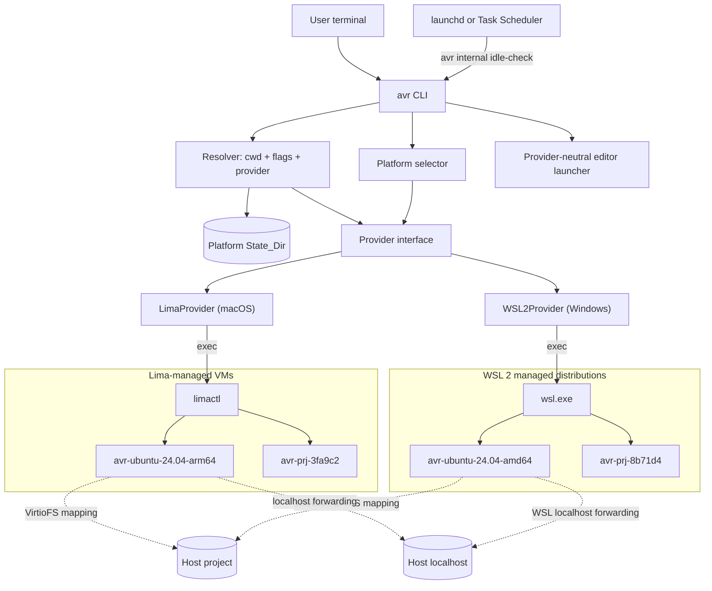

# Design Document — avar (`avr`)

## 1. Overview

avar is a single Go codebase that presents a **directory-centric, shell-first** interface over provider-managed Linux environments. The MVP ships a macOS binary backed by Lima; the post-MVP Windows build selects WSL 2 automatically. Every design decision follows from one product rule:

> The user thinks in terms of "current directory + selected operating environment." Machines, WSL distributions, mounts, transports, and images are avar's problem, never the user's.

### Key architectural decisions

| Decision | Choice | Rationale / trade-off |
|---|---|---|
| Host/provider routing | **`darwin` → LimaProvider; `windows` → WSL2Provider; unsupported hosts fail before dependency work** | Provider choice follows the host, not a user-visible flag. This keeps the command grammar identical and prevents Windows-specific branches from spreading through `cmd/` (Req 18.1, 18.14). |
| macOS backend | **Lima, driven via `limactl` subprocess** | Lima (Apache-2.0, CNCF incubating) already provides VM lifecycle, VirtioFS mounts, automatic localhost port forwarding, snapshots, and clone. Driving the CLI (vs importing Lima's Go packages) decouples avar from Lima's internal API churn. Cost: we parse `limactl` JSON output and depend on CLI stability, mitigated by a minimum-version check (Req 8.4). |
| Windows backend | **WSL 2, driven via `wsl.exe`; avar imports and owns dedicated distributions** | WSL 2 is already the Windows-native Linux runtime. Importing avar-owned root filesystems gives deterministic names, users, configuration, reset, and isolation without changing a user's existing WSL distributions (Req 18.2, 18.7). |
| Backend coupling | **Capability-segregated `Provider`; LimaProvider and WSL2Provider implement the same core contract** | Command-layer code references neither Lima nor WSL. Future OrbStack/SSH/cloud providers slot in without changing the CLI (Req 17.3, 18.14). |
| Environment model | **One shared environment per (provider, distro, arch); per-project environments only under `--isolate`** | Including provider in identity prevents cross-host collisions. Shared-by-default gives instant warm starts and package persistence; isolation is opt-in and remembered per project (Req 4.3, 11, 18.6). |
| VM stack per arch | **Host-native arch → `vmType: vz` (+ Rosetta binfmt enabled); foreign arch (`--arch amd64` on Apple Silicon) → `vmType: qemu`** | vz gives VirtioFS and near-native speed. Rosetta inside the arm64 VM covers "run this x86 binary" cheaply; a full qemu x86_64 VM covers "the whole OS must be amd64," with a one-time performance warning (Req 4.6). |
| File sharing | **Provider-neutral `MountSpec{HostPath, GuestPath}` mappings** | Lima maps both paths identically. WSL disables automatic drive mounting in avar-owned distributions and mounts only registered project paths through DrvFS at `/mnt/avr/projects/<Project_Identity>`. This preserves live edits without pretending `C:\...` can equal a Linux path (Req 6, 9.3, 18.5). |
| Shell transport | **Lima: `limactl shell`; Windows: `wsl.exe --distribution … --cd … --exec …`** | Both transports remain behind `Provider.Shell`, inherit console streams directly, and return guest exit codes without shell-string interpolation (Req 1–3, 18.8). |
| State | **Versioned flat files in the platform State_Dir** | `~/.avr/` on macOS and `%LocalAppData%\avar\` on Windows. Human-inspectable records plus atomic replace and an operation journal give crash recovery without a database (Req 17.5, 18.12–18.13). |
| No daemon | **avar is CLI-only; idle checks use a per-user OS scheduler** | `launchd` on macOS and Task Scheduler on Windows invoke the same internal command. No resident avar service is introduced (Req 5.5). |
| Language / CLI framework | **Go + `spf13/cobra`** | Single static binary, fast startup, first-class subprocess/PTY handling, same ecosystem as Lima itself. |

### Technology stack

- **Go 1.23+**, `spf13/cobra` (CLI), `golang.org/x/term` (TTY detection/raw mode), `creack/pty` only if needed for tests.
- **Lima ≥ 1.0** (minimum version pinned in code; checked at startup).
- **Windows 11 22H2+**, x64 or Arm64, with the current Store-delivered WSL whose version and required flags pass capability probes. Windows 10 is outside the first WSL2Provider support matrix.
- **Distribution**: GoReleaser → GitHub Releases; Homebrew tap (`brew install <tap>/avr`, formula depends on `lima`) for macOS; checksummed `avr.exe` archives for Windows initially.

### WSL research basis

The Windows design uses only documented platform behavior:

- Microsoft documents `wsl --install`, `--update`, `--status`, `--version`, `--list --verbose`, per-distribution `--terminate`, and destructive `--unregister`, plus WSL 2-only VHD export/import operations in the [WSL command reference](https://learn.microsoft.com/windows/wsl/basic-commands).
- WSL 2 is a real Linux kernel inside a Windows-managed utility VM, while distributions remain separately registered environments ([WSL architecture](https://learn.microsoft.com/windows/wsl/about)).
- Windows files are available to WSL through DrvFS, but Microsoft recommends Linux-native storage for Linux-heavy workloads because `/mnt/<drive>` access is slower ([filesystem guidance](https://learn.microsoft.com/windows/wsl/filesystems)).
- Windows-to-WSL localhost forwarding is automatic on normal WSL 2 installations; mirrored networking improves bidirectional and VPN behavior on Windows 11 22H2+ ([networking guidance](https://learn.microsoft.com/windows/wsl/networking)).
- VS Code accepts a WSL remote authority in the form `wsl+<distro name>` ([VS Code CLI](https://code.visualstudio.com/docs/configure/command-line)).

## 2. Architecture



### Primary data flow — `avr` (interactive) and `avr <cmd>` (one-shot)

1. **Parse**: `internal/cli.Parse` splits argv — avar's selector flags up to the first non-flag token; everything after is the guest command (Req 2.5). `--` forces the boundary (Req 2.6).
2. **Select provider**: `internal/platform` maps the host OS to one provider ID (`lima` or `wsl2`). Unsupported hosts fail before state or dependency mutation.
3. **Resolve**: `Resolver` computes the Environment_Selector from flags → project record/config → defaults and includes ProviderID in environment identity. Project_Identity hashes the platform-canonical host path (§3.2).
4. **Ensure deps**: the selected dependency checker validates Lima on macOS or WSL 2 on Windows; no unrelated runtime is checked or installed.
5. **Plan mapping**: the provider maps `(project root, cwd)` to a `MountSpec` plus GuestCwd. Lima preserves the path; WSL uses a deterministic `/mnt/avr/projects/<Project_Identity>` root.
6. **Ensure environment**: Provider creates (first use) or starts the target and reconciles the desired mount set. Slow or restart-requiring work is explained through `ProgressSink`.
7. **Attach**: `Provider.Shell` applies the explicit environment policy and starts the interactive shell or one-shot argv at GuestCwd. No command is assembled as a shell string; the guest exit code is propagated.
8. **Record**: session start/end is stored in the platform State_Dir, driving idle stop and `avr status`.

## 3. Components and Interfaces

### 3.0 Package layout and dependency direction

Shared vocabulary lives in **`internal/types`**: `ProviderID`, `EnvironmentSelector`, `Arch`, `Distro`, `MountSpec`, the persisted records (`ProjectRecord`, `MachineRecord`, `SessionRecord`), `MachineStatus`, and the `ProgressSink` contract. It holds data definitions and validation only — no I/O, subprocess execution, or output — and imports no other avar package.

This exists because `internal/state` must persist a selector while `internal/resolve` must read a project record: putting either type in the other's package creates a cycle. Dependencies therefore point inward:

```
cmd/  ─────────────────┐
  ├── internal/cli     │
  ├── internal/platform│
  ├── internal/resolve ├──> internal/types
  ├── internal/state   │
  ├── internal/deps    │
  └── internal/provider┘   (provider/lima, provider/wsl2, provider/fake implement it)
```

`internal/platform` is the only place allowed to branch on `runtime.GOOS`; it returns a provider factory, dependency checker, State_Dir resolver, and background-scheduler adapter. `internal/provider` owns `Provider` and its operation structs because they describe backend operations rather than shared vocabulary. Nothing in `cmd/` or `internal/resolve` may reference Lima, WSL, `limactl`, or `wsl.exe` (Req 17.3, 18.14).

### 3.1 Command Layer (`cmd/`)

**Purpose**: Map the user-facing grammar onto internal services. Owns all output formatting; nothing below it prints to the terminal (except streamed guest I/O).

**Grammar** — owned by `internal/cli.Parse`, a pure function over argv, **not** by cobra's flag parser:

```
avr [selector flags] [--] [COMMAND [ARGS...]]     # no COMMAND → interactive shell
avr [selector flags] status | stop [--all] | code
avr snapshot [NAME] | restore NAME | reset [--yes]     (Phase 2)
avr isolate off                                        (Phase 2)

Selector flags: --arch arm64|amd64   --distro NAME[:VERSION]   --isolate | --shared
Forwarding flags (Phase 2): --env NAME[=V] (repeatable)  --env-file PATH  --ssh-agent
```

Subcommand-vs-guest-command resolution (Req 2.5/2.6): after selector flags, if the next token is a known avr subcommand it wins; `--` always forces guest execution. This is deterministic and documented in `avr --help`.

**Why not cobra** (amended after implementation): the root command sets `DisableFlagParsing: true` and delegates to `internal/cli.Parse`. Two reasons the original `SetInterspersed(false)` plan failed in practice:

- pflag consumes the `--` token, so recovering the Req 2.6 boundary means threading `ArgsLenAtDash()` through the command layer — the one rule that must be unambiguous becomes a side effect of a framework's internals.
- With cobra parsing on the root, an unimplemented subcommand's flag is rejected before its command exists: `avr stop --all` errors until task 10 lands.

Parsing in a pure function makes the split deterministic and fuzzable (Property 9) and keeps it out of reach of framework behaviour. Cobra still renders help and routes avar's own subcommands; the selector flags are declared on the root purely so `avr --help` documents them.

`internal/cli.Parse` returns an `Invocation` carrying the validated-but-not-defaulted `Selector`, the `Mode` (shell / guest command / subcommand), the subcommand and its unparsed args, the verbatim guest argv, and the help/version intents. Supplying defaults and resolving the distro/version matrix is the resolver's job (§3.2), not the grammar's.

**Exit codes**: `2` for a command line avar cannot read (unknown flag, missing flag value, unsupported `--arch`/`--distro`), distinguishing "avar could not understand you" from `1`, "the operation failed". Req 4.4 requires only non-zero; this is the finer convention avar adopts.

**Does not**: branch on host OS, talk to `limactl`/`wsl.exe`, or read/write state files directly.

### 3.2 Resolver (`internal/resolve`)

**Purpose**: Turn (ProviderID, cwd, flags, state, optional `.avr.toml` post-MVP) into a fully specified selector plus target environment name. Provider-specific host-to-guest path mapping happens after resolution through `Provider.MapProjectPath`.

```go
type EnvironmentSelector struct {
    Distro   Distro   // ubuntu | debian | fedora (+ pinned version)
    Arch     Arch     // arm64 | amd64
    Isolated bool
}

type ResolvedTarget struct {
    Provider     ProviderID
    Selector    EnvironmentSelector
    MachineName string      // deterministic within ProviderID
    Project     ProjectRecord
    HostCwd     string      // canonical host path; never passed directly to a guest
}

func Resolve(provider ProviderID, cwd string, flags Flags, st *state.Store) (ResolvedTarget, error)
```

**Environment naming** (deterministic within a provider; the avar prefix is also the ownership marker):

- Shared: `avr-<distro>-<version>-<arch>` → `avr-ubuntu-24.04-arm64`
- Isolated: `avr-prj-<first 10 hex of Project_Identity>-<distro>-<version>-<arch>` → `avr-prj-3fa9c2b1d0-ubuntu-24.04-arm64`

*(Amended during task 4.* The isolated name originally omitted the environment, which made a project's isolated machine identified by the project alone. An isolated environment is derived from a clean base image of **the selected** (distro, arch) — Req 11.1 — so the environment is part of what identifies it: without it, `avr --isolate --distro fedora` in a project already isolated on Ubuntu resolves to the existing Ubuntu machine and silently hands the user the wrong distribution (Req 4.2). It also keeps isolation consistent with Req 4.3, where each distinct (distro, arch) already gets its own machine. The project hash still guarantees the name is stable from any depth within the project. Longest name in the current matrix: 37 characters.)*

**Precedence**: explicit flags > project record (remembered isolation, Req 11.2) > global State_Dir `config.toml` defaults > built-in defaults (ubuntu 24.04, host-native arch, shared). On WSL2Provider, a foreign architecture fails capability validation before any environment is created (Req 18.6).

**Project identity**: macOS keeps `EvalSymlinks(abs(cwd))`. Windows first resolves the volume and final path, converts separators to `\`, removes non-root trailing separators, normalizes drive-letter/UNC casing using case-insensitive comparison semantics, and hashes a prefixed key such as `windows:c:\users\ola\code\app`. Display casing remains in `ProjectRecord.Path`; only `PathKey` is normalized. This prevents `C:\Code\App`, `c:/code/app`, and equivalent separator spellings from creating different records (Req 18.13).

**Rationale**: a pure function over explicit provider, path, flags, and state inputs makes selection unit-testable and makes Property 2 deterministic on both host families.

### 3.3 State Store (`internal/state`)

**Purpose**: Durable, crash-consistent record of everything avar knows. All writes are atomic and guarded by a per-user advisory lock so concurrent invocations serialize state mutations (Req 17.5, 18.12).

Layout:

```
<State_Dir>/                    # ~/.avr on macOS; %LocalAppData%\avar on Windows
  schema.json        # state schema version + completed migrations
  config.toml        # user-editable global defaults (idle timeout, resources, forward_env allowlist)
  projects.json      # Project_Identity → ProjectRecord
  machines.json      # machines avar created: name → MachineRecord
  sessions.json      # live session pids per machine (idle-stop input)
  operations.json    # pending create/restore/delete journal for crash recovery
  ssh/config         # avar-owned SSH host entries (avr code), included via Include
  distros/           # WSL install roots; Windows only
  snapshots/         # provider snapshot artifacts and metadata
  logs/              # provisioning logs (referenced in error messages)
```

Windows uses `ReplaceFile`/`MoveFileEx` semantics for atomic replacement rather than assuming POSIX `rename`; directory creation grants only the current Windows user and administrators access. State schema v2 migrates existing `Mounts []string` entries into `MountSpec{HostPath: p, GuestPath: p}` and `VMType` into `Runtime`, assigning `Provider: "lima"` to pre-Windows records.

`operations.json` records intent before an external create, restore, or destructive unregister. A reconciler may adopt or remove an unrecorded backend environment only when a matching pending operation and on-guest avar marker prove ownership. A name prefix alone never authorizes mutation.

**Does not**: know how Lima or WSL operates. Backend reality (`limactl` or `wsl.exe`) remains the source of truth; the provider reconciles that reality with avar's records and operation journal.

### 3.4 Provider Interface (`internal/provider`)

**Purpose**: Backend abstraction (Req 17.3, 18.14). Command orchestration depends only on this interface; the Resolver depends only on shared types.

The operations are **segregated by capability** rather than gathered into one interface. `Provider` is the core set every backend must implement; `Snapshotter`, `EditorTargetProvider`, and `PortDiagnoser` describe optional abilities. Callers type-assert for a capability and report plainly when it is absent. Editor launch is modeled by a transport-neutral target, so WSL is not forced through SSH.

```go
type Provider interface {
    ID() types.ProviderID

    // MapProjectPath converts a canonical host project/cwd pair into the mount
    // the backend must apply and the working directory Shell must receive.
    // It is deterministic and performs no external mutation.
    MapProjectPath(projectID, hostRoot, hostCwd string) (mount MountSpec, guestCwd string, err error)

    // EnsureMachine creates the machine if absent, starts it if stopped, and is a
    // silent no-op when it is already running (Req 1.2/1.3 — called every invocation).
    // On failure nothing half-created survives (Req 1.6, Property 7).
    // Emits Creating / Starting / Warning (emulation, Req 4.6) events.
    EnsureMachine(ctx context.Context, spec MachineSpec, progress types.ProgressSink) error

    // Shell attaches an interactive shell (empty Argv) or runs argv on an
    // already-running machine, and returns the guest exit code. A non-zero guest
    // status is (code, nil) — never a Go error (Req 1.7/2.2, Property 3).
    // Streams stdio; allocates PTY iff opts.TTY; forwards SIGINT/SIGTERM/SIGWINCH.
    // Takes no ProgressSink: once attached, avar is silent.
    Shell(ctx context.Context, machine string, opts ShellOpts) (exitCode int, err error)

    // Mounts. SetMounts takes the complete desired set and replaces what is applied,
    // which is what makes mount confinement checkable (Property 5). Idempotent: an
    // unchanged set means no restart (Req 17.1).
    AppliedMounts(ctx context.Context, machine string) ([]MountSpec, error)
    SetMounts(ctx context.Context, machine string, mounts []MountSpec, progress types.ProgressSink) error

    Stop(ctx context.Context, machine string, progress types.ProgressSink) error // stopped → no-op; unknown → ErrMachineNotFound
    Delete(ctx context.Context, machine string) error                            // fully idempotent (cleanup path, Property 7)
    Status(ctx context.Context) ([]types.MachineStatus, error)                   // avar-owned machines only, sorted (Req 5.4, Property 6)
}

// Phase 2 capabilities, implemented only by backends that actually have them.
type Snapshotter interface {
    Snapshot(ctx context.Context, machine, name string, progress types.ProgressSink) error
    RestoreSnapshot(ctx context.Context, machine, name string, progress types.ProgressSink) error
    ListSnapshots(ctx context.Context, machine string) ([]SnapshotInfo, error)
}

type EditorTargetProvider interface {
    EditorTarget(ctx context.Context, machine, guestPath string) (EditorTarget, error)
}

// PortDiagnoser explains forwarding state (Req 7.2). Forwarding itself is not an
// operation — it happens without avar asking — so there is only something to report.
type PortDiagnoser interface {
    PortDiagnostics(ctx context.Context, machine string) ([]PortDiagnostic, error)
}

type MachineSpec struct {
    Name       string                     // avr-…, from the resolver (ownership marker)
    Provider   types.ProviderID
    Selector   types.EnvironmentSelector
    Kind       types.MachineKind          // shared | isolated | base
    Mounts     []MountSpec                 // provider-planned host → guest mappings
    CPUs       int                        // zero → backend's host-proportional default (Req 17.4)
    MemoryGB   float64
    DiskGB     float64
    DeriveFrom string                     // optional pristine base to copy (Req 11.1); a hint, not a requirement
}

type MountSpec struct {
    ProjectID string
    HostPath  string // canonical host path
    GuestPath string // absolute Linux path chosen by Provider.MapProjectPath
    Writable  bool
}

type ShellOpts struct {
    Workdir string            // guest path, never a raw Windows path
    Argv    []string          // empty → interactive login shell
    Env     map[string]string // ONLY what policy explicitly allows; never merged with the
                              // host environment (Req 9.1/12, Property 4)
    TTY     bool
    Stdin   io.Reader         // nil → the calling process's stream; redirection is invalid with TTY.
    Stdout  io.Writer         // Used by avar's own guest probes (e.g. mount verification, Req 6.5)
    Stderr  io.Writer         // so their output never reaches the user's terminal.
    ForwardSSHAgent bool      // Phase 2
}

type EditorTarget struct {
    Authority string // ssh-remote+<alias> or wsl+<distribution>
    GuestPath string
    SSHConfig string // optional; populated by Lima, empty for WSL
}
```

`MapProjectPath` rules:

- Lima: `HostPath == GuestPath`; GuestCwd is the host cwd.
- WSL: the project root maps to `/mnt/avr/projects/<Project_Identity>` and GuestCwd appends the validated relative path from project root to host cwd. Path traversal outside the root is rejected.

Sentinel errors (`ErrNotOwned`, `ErrMachineNotFound`, `ErrMachineNotRunning`, `ErrSnapshotNotFound`, `ErrUnsupportedCapability`, `ErrRestartRequired`) let orchestration react to conditions instead of matching message text; §6 maps them onto user-facing behavior.

### 3.5 LimaProvider (`internal/provider/lima`)

**Purpose**: Implement `Provider` by shelling out to `limactl`.

Key mappings:

| Provider op | limactl mechanism |
|---|---|
| Create machine | `limactl start --name <n> --tty=false <generated .yaml>` — avar generates a full Lima config from an embedded template per (distro, arch): base image URL (pinned, checksummed), `vmType` (vz native / qemu foreign), `rosetta: {enabled,binfmt}: true` on vz+arm64, CPU/mem/disk from Req 17.4, mounts list, `mountType: virtiofs` (vz), provision script (create user matching host username + NOPASSWD sudo — Lima does this by default). |
| Start | `limactl start <n> --tty=false` |
| Shell | `limactl shell --workdir <cwd> <n> [-- argv...]`; avar wraps with env policy (env vars passed as `FOO=bar` prefix tokens, which `limactl shell` quotes correctly) and inspects the child's exit code (`limactl shell` propagates the remote exit status). |
| Mounts | Read: `limactl list <n> --json` (`.config.mounts`). Write: `limactl edit <n> --set '.mounts = [...]' --tty=false`, then stop/start if running. |
| Port forwarding | Nothing to do — Lima's hostagent auto-forwards guest-localhost TCP ports to host localhost and releases them on close (Req 7.1/7.3). avar surfaces conflicts by reading the hostagent log in `avr status` diagnostics (Req 7.2). |
| Stop / Delete | `limactl stop <n>` / `limactl delete <n>` |
| Snapshot / Restore | `limactl snapshot create/apply/list <n> --tag <name>` (instance is stopped first if the operation requires it, then restarted if it was running). |
| Isolated create (fast path) | Keep a pristine, stopped base machine per (distro, arch) (`avr-base-<distro>-<ver>-<arch>`); `limactl clone` it for `--isolate` (clone copies disk + ssh config verbatim, so it is fast and deterministic). Fallback: full provision if no base exists. |
| Reset | `limactl delete <n>` + re-create from template/base (Req 10.3). |
| SSH config | Read Lima's generated per-instance `~/.lima/<n>/ssh.config` and re-emit it into `~/.avr/ssh/config` under host alias `avr-<machine>`. **Not `limactl show-ssh`**: verified deprecated in Lima 2.2.0, which prints a warning directing callers to `ssh -F ~/.lima/<n>/ssh.config lima-<n>`. Building `avr code` (task 19) on a deprecated command would inherit its removal. |

**Mount-change restart policy** (Req 6.4): mount edits requiring restart are expected to be rare (first `avr` in each new project). The provider reports a `ProgressSink` event ("Adding /Users/you/code/newproj to your Linux environment — one-time restart, ~10s") so the UX cost is explained. Registered mounts accumulate in the machine config, so revisiting any known project is instant.

**Ownership guard** (Req 5.4): **mutating** operations validate that the machine name has the `avr-` prefix *and* appears in `machines.json`. Recovery of an interrupted create additionally requires a matching operation-journal entry.

**`Status` filters on the prefix alone** — deliberately weaker, and amended after implementation. Filtering the listing by registry membership as well makes a machine avar created but never finished recording invisible, which is precisely the damage a crash mid-create leaves and precisely what reconciliation (§3.3) exists to adopt. With the stricter filter, adoption is unimplementable. Req 5.4's own wording is prefix-based ("identified by an avar naming prefix/label"), so prefix-only listing is the requirement-faithful reading. Listing is how avar *discovers* damage; mutating is how it *acts* on it, and only the latter needs the record.

`Status` populates `Kind` and `Selector` for unrecorded machines as far as the listing and the deterministic name allow, leaving unknown fields zero rather than guessing — an orphan the reconciler cannot attribute is left alone, never filed under a guessed project.

**Machine state mapping**: a machine that is *coming up* (Lima `Installing`/`Uninitialized`) must map to its own `types.MachineState` value, never to `StateBroken` or `StateUnknown`. Reconciliation deletes unrecorded machines in those two states, and an in-flight create has no record yet: collapsing "starting" into "broken" lets one invocation delete the machine another is still creating. Unrecognised state values are left alone by design, which is what makes a distinct value safe.

### 3.6 WSL2Provider (`internal/provider/wsl2`) — Post-MVP

**Purpose**: Implement the existing Provider contract on supported Windows hosts by driving `wsl.exe`, while owning dedicated imported WSL 2 distributions and never mutating distributions the user installed independently (Req 18).

**Support matrix**: Windows 11 22H2+ on x64 and Arm64, with Store-delivered WSL passing `wsl --version` and CLI capability probes. Each WSL environment uses the host-native architecture only. `--arch amd64` on Arm64 and `--arch arm64` on x64 return `ErrUnsupportedCapability` before download or import.

**Provisioning model**:

1. Select a pinned, checksummed official rootfs artifact from the same distro/version matrix used by Lima.
2. Write a `create` intent to `operations.json`, download into the State_Dir cache, and verify SHA-256 before import.
3. Run `wsl.exe --import <avr-name> <State_Dir>\distros\<avr-name> <rootfs.tar> --version 2`.
4. Provision as root: create a sanitized Linux username derived from the Windows account, grant passwordless sudo, write `/etc/avar/managed.json` (provider, avar name, selector, image digest), and configure `/etc/wsl.conf` with that default user, systemd enabled, Windows PATH injection disabled, and automatic drive mounting disabled.
5. Terminate and restart only that distribution so `wsl.conf` takes effect; verify WSL version 2, marker identity, non-root default user, passwordless sudo, and an empty applied-mount set.
6. Commit `MachineRecord` and clear the operation journal. Any failure unregisters the partial avar distribution, removes its install directory, and leaves no machine record.

Using imported distributions avoids first-launch username prompts and prevents avar from adopting or modifying `Ubuntu`, `Debian`, or any other user-managed registration. The default user for an imported distribution is configured through `/etc/wsl.conf`, which Microsoft documents for imported distributions.

**Operation mapping**:

| Provider operation | WSL 2 mechanism |
|---|---|
| List and version check | `wsl.exe --list --quiet`, `--list --running --quiet`, and `--list --verbose`. The parser decodes UTF-16 when present and extracts avar's no-whitespace names plus the numeric WSL version from the right, avoiding localized header/state matching. |
| Start / ensure | A no-output probe through `wsl.exe --distribution <name> --user root --exec /bin/true`; WSL starts a stopped distribution on demand. Marker and WSL-2 checks run on cold start and reconciliation, not every warm attach. |
| Path mapping | `MapProjectPath` maps a registered host root to `/mnt/avr/projects/<Project_Identity>` and preserves the cwd's relative suffix. |
| Mounts | Reconcile selective DrvFS mounts as root with argv-safe execution (no interpolated shell string). `/proc/self/mountinfo` is the applied source of truth. Automatic drive mounting remains disabled, so avar does not expose an entire drive merely to share one project. |
| Shell / command | `wsl.exe --distribution <name> --user <avar-user> --cd <GuestCwd> --exec <argv...>`. The pinned WSL minimum must advertise `--cd`; args are passed as distinct Windows process arguments. Interactive mode execs the user's login shell. |
| Stop | `wsl.exe --terminate <name>`; never `wsl --shutdown`, which would stop user-owned distributions too. |
| Delete / reset | Ownership guard → `wsl.exe --unregister <name>` → remove the avar-owned install directory only after unregister succeeds. Reset reimports the pinned clean rootfs. |
| Snapshot | Terminate if needed, then `wsl.exe --export <name> <snapshot.vhdx> --vhd`; store metadata with selector, provider, digest, and timestamp; restart if previously running. |
| Restore | Journal intent; export a temporary rollback VHDX; unregister the target; import the selected VHDX under the same avar name; verify marker/user/mount invariants. On failure, unregister the partial restore and reimport the rollback VHDX. Snapshot and rollback files remain until success is committed. |
| Isolated create | Import from a cached clean base export into `distros\<isolated-name>` with `--version 2`, then write a unique marker and mount only that project. |
| Port diagnostics | Discover listeners inside the distro (`ss -ltnp` where permitted), probe the matching Windows localhost ports, and report guest-listening/host-unreachable conflicts without modifying global WSL networking. |
| Editor target | Return `EditorTarget{Authority: "wsl+<name>", GuestPath: <path>}`; no SSH stanza is generated (Req 18.10). |

**Terminal behavior**: `wsl.exe` inherits the calling console handles. With a TTY, avar attaches the console and lets Ctrl-C/resize flow through the foreground process group; with redirected stdin/stdout it uses pipes and does not allocate a console PTY. Windows interrupt handling is encapsulated in `internal/provider/wsl2/console_windows.go`; builds for other hosts use platform stubs. Guest non-zero exit status remains `(code, nil)`.

**Security boundary**: avar-owned distributions start with automatic drive mounts and Windows PATH injection disabled, and avar mounts only registered projects. WSL is still a developer convenience boundary, not a hostile-code sandbox: a guest administrator with passwordless sudo can deliberately reconfigure WSL integration. Help and security documentation must state this limitation without weakening avar's default mount policy.

**Native workspace advisory**: `internal/workspace/perf` emits a once-per-project recommendation when a Windows-backed project has a dependency-heavy manifest/lockfile (`package-lock.json`, `pnpm-lock.yaml`, `yarn.lock`, `Cargo.lock`, or equivalent configured detector) or crosses a deterministic file-count threshold. Dismissal is stored in `ProjectRecord`; acceptance routes to Requirement 14, never an implicit copy.

### 3.7 Dependency Manager (`internal/deps`)

**Purpose**: Validate only the dependency required by the selected provider.

- `deps/lima`: Req 8. `limactl --version` → parse → compare to `MinLimaVersion`. If missing: prompt (default No when non-interactive), run `brew install lima` streaming output, re-verify. If brew is missing or declined: print manual instructions and exit 1.
- `deps/wsl2`: run `wsl.exe --version`, `--status`, and capability probes. If WSL is absent/disabled, explain the elevation and restart implications before offering `wsl.exe --install --no-distribution`. If installed but below the pinned minimum, offer `wsl.exe --update`. Setup actions do not create an avar distribution; a restart-required result returns `ErrRestartRequired` with an idempotent “restart, then rerun `avr`” instruction. A WSL 1 avar registration is rejected with the exact `wsl.exe --set-version <name> 2` recovery command but never converted automatically (Req 18.3–18.4).

### 3.8 Session & Idle Manager (`internal/session`) — Phase 2 for idle stop

**Purpose**: Track active sessions (Req 5.1 "in use", Req 5.5 idle stop) independent of provider.

- On attach, append `{machine, pid, started_at}` to `sessions.json`; remove on exit (defer + best-effort). Stale entries (dead pid) are pruned on every read.
- Idle stop: avar installs (with one-time notice) a per-user scheduled invocation of `avr internal idle-check` every 10 minutes: `launchd` on macOS, Task Scheduler on Windows. For each running avar environment with zero live sessions and `last_activity + IdleTimeout < now`, call its recorded Provider's `Stop`. `idle_timeout = "0"` disables it.
- Windows Task Scheduler registration uses the current user's token and the absolute `avr.exe` path, requires no elevation, and is updated after binary upgrades. Removing avar removes only its named task.

### 3.9 Editor Launcher (`internal/editor`) — Phase 2

**Purpose**: Req 13/18.10. Ensure the environment is running, request an `EditorTarget`, then execute `code --remote <authority> <guest-path>`.

- Lima returns `ssh-remote+<alias>` plus an SSH stanza. The launcher writes/refreshes the State_Dir SSH file and asks once before adding its `Include` to the user's SSH config (Req 13.3).
- WSL returns `wsl+<distribution>` and no SSH material. The launcher checks that the VS Code WSL extension/authority can be resolved and gives installation guidance if not.
- Missing `code` produces platform-appropriate PATH guidance. No backend-specific branch exists in `cmd/code.go`.

### 3.10 Env/Credential Forwarding Policy (`internal/envpolicy`) — Phase 2 (defaults enforced from Phase 1)

**Purpose**: Req 9.1/9.2, 12. Pure function: `(baseAllowlist=[TERM, LANG, LC_*], --env flags, --env-file, config.toml forward_env) → map[string]string`. `--ssh-agent` sets `ShellOpts.ForwardSSHAgent` for that invocation only (Req 12.3/12.4). Phase 1 ships the function with only the base allowlist wired.

On Windows, WSL2Provider invokes the guest through `/usr/bin/env -i` plus this computed map, clears `WSLENV`, and provisions `appendWindowsPath=false`; arbitrary Windows environment variables therefore do not cross merely because WSL supports interop.

## 4. Data Models

```go
type ProjectRecord struct {
    ID          string    `json:"id"`       // sha256(platform-prefixed PathKey)
    Path        string    `json:"path"`     // canonical display path + mount source
    PathKey     string    `json:"path_key"` // normalized identity input; case-folded on Windows
    Isolated    bool      `json:"isolated"` // remembered --isolate default (Req 11.2)
    Selector    *EnvironmentSelector `json:"selector,omitempty"` // remembered distro/arch overrides
    NativeFSAdvisoryDismissed bool `json:"native_fs_advisory_dismissed,omitempty"`
    CreatedAt   time.Time `json:"created_at"`
    LastUsedAt  time.Time `json:"last_used_at"`
}

type MachineRecord struct {
    Name       string              `json:"name"`       // avr-… (one ownership marker)
    Provider   ProviderID          `json:"provider"`   // lima | wsl2
    Selector   EnvironmentSelector `json:"selector"`
    Kind       string              `json:"kind"`       // shared | isolated | base
    ProjectID  string              `json:"project_id,omitempty"` // for isolated
    Mounts     []MountSpec         `json:"mounts"`     // applied host → guest mappings
    CreatedAt  time.Time           `json:"created_at"`
    Runtime    string              `json:"runtime"`    // vz | qemu | wsl2 (status display)
    ImageDigest string             `json:"image_digest"`
}

type SessionRecord struct {
    Provider  ProviderID `json:"provider"`
    Machine   string    `json:"machine"`
    PID       int       `json:"pid"`
    StartedAt time.Time `json:"started_at"`
}

type PendingOperation struct {
    ID         string          `json:"id"`
    Provider   ProviderID      `json:"provider"`
    Machine    string          `json:"machine"`
    Kind       string          `json:"kind"` // create | restore | delete
    Stage      string          `json:"stage"`
    Rollback   string          `json:"rollback,omitempty"`
    StartedAt  time.Time       `json:"started_at"`
}
```

**Lifecycle rules**

- `ProjectRecord` is created the first time `avr` runs in a directory; never deleted automatically.
- `MachineRecord` is written only after the selected provider verifies a usable environment and is removed only after provider deletion succeeds. External destructive work is preceded by a `PendingOperation`.
- Reconciliation may adopt an interrupted create only when prefix, operation journal, and on-guest marker agree. A prefix-only Lima VM or WSL distribution is reported for manual inspection and never mutated.
- Mount mappings grow through project registration; `avr status` renders host and guest paths when they differ. Pruning remains a post-MVP concern.
- Windows snapshot/restore keeps a durable rollback artifact until the restored environment passes marker, user, WSL-version, and mount checks and the journal is committed.

**Validation constraints**: environment names match `^avr-[a-z0-9.-]+$`; project paths must be platform-absolute, exist, and be directories at registration time; `MountSpec.GuestPath` must be absolute and normalized; WSL guest mappings must stay beneath `/mnt/avr/projects/`; distro/version pairs must be in the provider's supported matrix.

## 5. Correctness Properties

### Property 1: Working-directory equivalence
_For any_ host directory D beneath registered project P, `MapProjectPath(P, D)` SHALL yield a guest directory G whose relative suffix within the guest mount equals D's relative suffix within P and whose visible contents equal D's; on Lima G equals D, while on WSL G is beneath the deterministic project mount.
**Validates: 1.1, 2.1, 6.1, 6.6, 18.5**

### Property 2: Deterministic target resolution
_For any_ fixed (ProviderID, cwd, flags, state) input, `Resolve` SHALL return the same `ResolvedTarget`, and **no two distinct environments SHALL ever share a machine name** — neither two shared environments differing in (provider, distro, version, arch), nor two isolated environments differing in project *or* in environment. An isolated environment is identified by both, which is why its name carries both (§3.2).
**Validates: 4.1, 4.2, 4.3, 11.1, 11.2, 18.1, 18.6**

### Property 3: Exit-code transparency
_For any_ guest command exiting with code N (0 ≤ N ≤ 255), `avr <cmd>` SHALL exit with code N; _for any_ interactive shell exiting with code N, `avr` SHALL exit with code N.
**Validates: 1.7, 2.2, 18.8**

### Property 4: Environment isolation by default
_For any_ host environment variable V not in the base terminal allowlist and not explicitly forwarded, V SHALL be absent from the guest session's environment.
**Validates: 9.1, 12.4, 18.8**

### Property 5: Configured mount confinement
_For any_ environment M, the set of host paths avar configures as mounts SHALL equal the project roots registered to M and every guest target SHALL equal the provider-planned target — in particular, avar SHALL never configure the host home, credential directories, a whole Windows drive, or an unregistered sibling.
**Validates: 6.3, 9.3, 9.4, 11.5, 18.5**

### Property 6: Ownership confinement
_For any_ Lima VM or WSL distribution that lacks the avar prefix, **no** avar operation SHALL list, start, stop, modify, export, unregister, or delete it — it is invisible, and not even reported.

_For any_ prefixed environment that additionally lacks a matching avar ownership record, no **mutating** avar operation SHALL act on it, with one bounded exception: reconciliation may adopt it (write the missing record) or delete it when the backend reports it unusable. Listing is not restricted by the record, because a missing record is the damage reconciliation repairs and demanding it would be circular. Recovery of an interrupted create additionally requires a matching pending operation and guest marker.

**Validates: 5.4, 18.7, 1.6, 17.5**

### Property 7: Provisioning atomicity
_For any_ failed or interrupted provider create or restore, a subsequent `avr` invocation SHALL observe either a verified usable environment with a committed record, or a journaled state from which it can safely resume/roll back/clean up, never an unowned partial environment or a committed record for an unusable target.
**Validates: 1.6, 17.5, 18.3, 18.12**

### Property 8: Signal and TTY fidelity
_For any_ one-shot command, a PTY SHALL be allocated iff host stdin is a TTY, and SIGINT/SIGTERM delivered to `avr` SHALL reach the guest process; _for any_ interactive session, terminal resize SHALL propagate.
**Validates: 2.3, 2.4, 3.1, 3.3, 18.8**

### Property 9: Subcommand/guest-command resolution
_For any_ argv, the first non-selector-flag token SHALL be interpreted as an avar subcommand iff it is in the subcommand set, and prefixing `--` SHALL always force guest interpretation.
**Validates: 2.5, 2.6**

### Property 10: Reset scoping
_For any_ `avr reset`, host project files SHALL be byte-identical before and after, and _for any_ reset in a project with an Isolated_Environment, no other machine SHALL be modified.
**Validates: 10.3, 11.4, 18.12**

### Property 11: Idle-stop safety
_For any_ machine with at least one live session, the idle agent SHALL NOT stop it, regardless of elapsed time.
**Validates: 5.5**

### Property 12: Host-provider routing
_For any_ supported host OS, provider selection SHALL return exactly its designated provider and dependency checker, and every command-layer invocation SHALL produce the same parsed grammar regardless of provider.
**Validates: 18.1, 18.14**

### Property 13: Dependency isolation
_For any_ Windows invocation, dependency validation SHALL execute only WSL checks/actions and SHALL never require or invoke Lima, Docker Desktop, or third-party VM tooling; _for any_ restart-required WSL setup result, no MachineRecord or WSL distribution SHALL have been created.
**Validates: 18.2, 18.3**

### Property 14: Windows path identity and mapping
_For any_ equivalent Windows path spellings that differ only by drive-letter casing, separator direction, redundant cleanable segments, or filesystem casing, Project_Identity SHALL be equal; _for any_ distinct canonical paths, the WSL guest mount targets SHALL be distinct and beneath `/mnt/avr/projects/`.
**Validates: 18.5, 18.13**

### Property 15: WSL 2 enforcement
_For any_ avar-owned distribution reported as WSL version 1, WSL2Provider SHALL perform no shell, mount, snapshot, reset, or editor operation and SHALL return the WSL-2 upgrade guidance without converting it automatically.
**Validates: 18.4**

### Property 16: WSL destructive-operation safety
_For any_ snapshot restore, reset, isolation change, interrupted create, or interrupted restore on Windows, all host project files SHALL remain byte-identical and no user-managed WSL distribution SHALL change.
**Validates: 18.7, 18.12**

### Property 17: Provider-specific editor target
_For any_ Windows `avr code` target, the editor authority SHALL be `wsl+<owned-distribution>` with no SSH configuration output; _for any_ Lima target, it SHALL be an avar-owned SSH authority with its stanza confined to the State_Dir.
**Validates: 13.1, 13.3, 18.10**

### Property 18: Architecture capability rejection
_For any_ WSL selector whose architecture differs from the Windows host architecture, resolution SHALL return the supported architecture list before download, import, state mutation, or distribution creation.
**Validates: 18.6**

### Property 19: Port failure non-disruption
_For any_ guest TCP listener that Windows localhost cannot reach, the guest session SHALL remain active and `PortDiagnostics` SHALL report the listener and actionable host-side failure rather than mutating global WSL networking.
**Validates: 18.9**

### Property 20: Native-workspace advisory consent
_For any_ Windows-backed project matching the documented I/O-heavy heuristic, avar SHALL show at most one advisory unless the user asks again; dismissing it SHALL not copy files, and accepting it SHALL use the conflict-safe Requirement 14 workflow.
**Validates: 18.11**

### Property 21: Windows artifact and provider purity
_For any_ supported Windows architecture, the release build SHALL produce a self-contained `avr.exe`; static dependency checks SHALL find no WSL-specific imports outside the WSL provider, Windows dependency checker, platform adapter, scheduler adapter, or Windows-only terminal files.
**Validates: 18.14**

## 6. Error Handling

**Principles**: every failure names (what avar was doing) + (underlying cause, with the tail of the relevant log) + (one suggested next step). Guest command failures are *not* avar errors — stderr and exit code pass through untouched.

| Failure | Detection | Behavior |
|---|---|---|
| Lima missing / too old / brew missing | `deps` check at startup | Req 8.2–8.4 flows; exit 1; never proceed against unsupported Lima. |
| WSL missing, disabled, or too old | `wsl.exe --version/status/help` capability checks | Explain required elevation/update/restart before offering an action. Never create a distro in the same run when a host restart is required; return `ErrRestartRequired` (Req 18.3, Property 13). |
| Avar-owned distribution is WSL 1 | numeric version from `wsl --list --verbose` | Refuse all environment operations and show `wsl.exe --set-version <name> 2`; never convert implicitly (Req 18.4, Property 15). |
| Foreign architecture requested on Windows | provider capability validation | Exit 2 listing the one host-native supported value before image download or state mutation (Req 18.6, Property 18). |
| Provision fails (image download, checksum, qemu/import failure, disk full) | provider create returns non-zero | Print cause + platform State_Dir log path; use the operation journal to delete only the proven partial target; write no `MachineRecord` (Property 7). |
| Start fails on existing machine | `limactl start` non-zero | Report; suggest `avr status` and (Phase 2) `avr reset`. Do not auto-delete user data. |
| Avar killed mid-create | pending journal plus backend target and guest marker inspection | Matching journal+marker and healthy target → finish/commit; matching journal and partial target → clean and retry; no journal or mismatched marker → report and never mutate (Properties 6–7). |
| Mount not possible (network volume, perms) | pre-flight `os.Stat` + mount verification after apply (`test -d` in guest) | Exit 1 with explanation; never drop into a shell at a wrong/empty path (Req 6.5). |
| Windows path cannot be canonicalized or DrvFS rejects it | final-path resolution or selective mount probe | Exit 1 naming the host path and cause; do not fall back to mounting the containing drive or to a different guest cwd (Req 18.5, Properties 1/5). |
| Mount requires restart while other sessions are live on that machine | `sessions.json` check | Prompt: restart now (disconnects N sessions) or abort. Non-interactive: abort with message. |
| Host port conflict / WSL localhost unreachable | Lima hostagent scan or guest-listener + Windows probe | Session unaffected; `avr status` lists the unforwardable listener and suggests checking binding, firewall/VPN, or WSL networking. Never rewrite `.wslconfig` automatically (Req 7.2, 18.9). |
| Concurrent `avr` invocations racing on create | file lock around ensure-machine | Second invocation waits on lock, then re-checks state (create becomes start/no-op). |
| `sessions.json` stale pids (crash) | pid liveness probe on read | Prune silently. |
| Snapshot/restore name errors | provider `ListSnapshots` | Unknown name → list available (Req 10.2). |
| WSL restore fails after unregister | pending restore journal + durable rollback VHDX | Remove only the partial avar target, reimport rollback, verify it, and retain both journal and artifacts if automatic rollback fails so the next invocation can recover (Req 18.12). |
| Existing WSL registration collides with generated avar name | quiet distro list + missing ownership record/marker | Return `ErrNotOwned`; never unregister, reuse, or rename the existing registration (Req 18.7). |
| WSL output encoding/localization differs | UTF-8/UTF-16 decoder + right-anchored numeric parsing | If required fields cannot be established without localized text matching, fail read-only with the raw output stored in a diagnostic log; perform no lifecycle mutation. |
| `code` CLI or required remote integration missing | PATH and editor-target launch probe | Give platform-appropriate VS Code guidance; WSL flow never falls back to SSH (Req 13.2, 18.10). |
| `--env-file` missing/unparseable | pre-flight | Exit 1 before any machine work (Req 12.2). |
| Ctrl-C during provisioning | context cancellation | Stop the provider subprocess, reconcile/clean only the journaled partial target, and exit 130. |

## 7. Testing Strategy

**Unit tests** (pure logic, no VMs):
- Host-provider routing and the rule that command parsing is provider-independent (Property 12).
- `Resolve` precedence table + provider-aware machine-name determinism (Property 2).
- Windows project-path canonicalization and `MapProjectPath` tables covering drive casing, slash forms, spaces, Unicode, UNC paths, nested cwd, and attempted traversal (Properties 1, 14).
- WSL architecture capability rejection before side effects (Property 18).
- Argv grammar: subcommand vs guest command vs `--` (Property 9) — table-driven over tricky argvs (`avr status`, `avr -- status`, `avr --arch amd64 npm test`, `avr --distro fedora code`).
- Env policy allowlist composition (Property 4).
- State store: schema-v1→v2 migration, Windows atomic replace adapter, lock behavior, and create/restore journal decision tables (Properties 7, 16).
- limactl output parsing against recorded `limactl list --json` fixtures from the pinned minimum Lima version.
- WSL output parsing fixtures for UTF-8/UTF-16, stopped/running, WSL 1/2, unexpected whitespace, and localized headers; only numeric/version/name fields may drive mutation.
- EditorTarget rendering proves WSL emits `wsl+<name>` with no SSH material and Lima behavior remains unchanged (Property 17).
- Native-workspace advisory heuristic and dismissal persistence (Property 20).

**Integration tests — FakeProvider/FakeRunner**:

- Full provider-neutral command flows (`avr` first-run, mount-add flow, `stop --all`, isolation remembering, reset scoping, editor launch) assert call sequences without a VM.
- WSL2Provider tests run on ordinary Windows CI against a fake `wsl.exe` runner and temporary State_Dir, asserting exact argv arrays for import, selective mounts, shell, terminate, export/import, unregister, and rollback. Tests reject any use of `wsl --shutdown` and any operation against a non-recorded distro.
- Static import/lint rules fail if WSL-specific packages appear in `cmd/` or `internal/resolve` (Property 21).

**End-to-end tests — real Lima** (separate `make e2e`, runs on a mac runner, not in unit CI):
- Cold `avr true` → provisions, exits 0; warm `avr sh -c 'exit 42'` → exits 42 (Property 3).
- `avr pwd` from nested subdir equals host path; touch file both sides (Property 1).
- `env` in guest shows no leaked host secret var (Property 4).
- Server in guest on :3000 reachable from host (Req 7.1).
- Warm-path attach overhead measured < 500 ms budget (Req 17.1).

**End-to-end tests — real WSL 2** (separate `make e2e-wsl`, runs on a disposable self-hosted Windows 11 runner with virtualization; not required on ordinary pull requests):

- Record `wsl --list --quiet` before and after; verify non-avar distributions are byte-for-byte the same set and state after every test (Properties 6, 16).
- Cold `avr true`, warm exit-42 propagation, interactive smoke, Ctrl-C, and piped stdio (Properties 3, 8).
- Invoke from nested `C:\...` paths with spaces/Unicode, verify guest cwd mapping, and modify files from both sides (Properties 1, 14).
- Confirm automatic drives are not mounted by avar configuration and only registered project mappings appear (Property 5).
- Snapshot/restore and isolated reset restore guest package state while host project hashes remain unchanged; inject failure after unregister and verify rollback (Properties 7, 10, 16).
- Guest server on port 3000 is reachable from Windows localhost; a forced conflict remains diagnostic-only (Property 19).
- Assert guest environment lacks a Windows secret marker and Windows PATH entries (Property 4).

**Build tests**: GoReleaser/cross-compilation produces Windows x64 and Arm64 `avr.exe` artifacts; smoke `avr --help` and grammar tests run on Windows CI. Release checks verify archive checksums and prohibit a Lima runtime dependency in Windows packaging.

**Property-based tests**: fuzz argv splitting (Property 9), env-policy composition (Property 4), Windows path canonicalization/mapping (Property 14), WSL list decoders, and journal recovery transitions (Properties 7/16) with `testing/quick` or `rapid`.

## 8. Out of Scope (recorded for post-MVP alignment)

Post-MVP scope now includes Windows hosts through avar-owned WSL 2 distributions (Req 18). Still out of scope: Windows Server, Windows 10, WSL 1 execution, adoption or management of user-owned WSL distributions, automatic mutation of global `%UserProfile%\.wslconfig`, Docker Desktop integration, and Windows-native containers.

Other post-MVP items remain `--native-fs` sync mode (Req 14), `.avr.toml` + `avr init` (Req 15), `avr ports`/`avr open` (Req 16), additional editors, OrbStack/SSH/cloud providers, VS Code terminal-picker extension, Linux hosts, and GUI.
