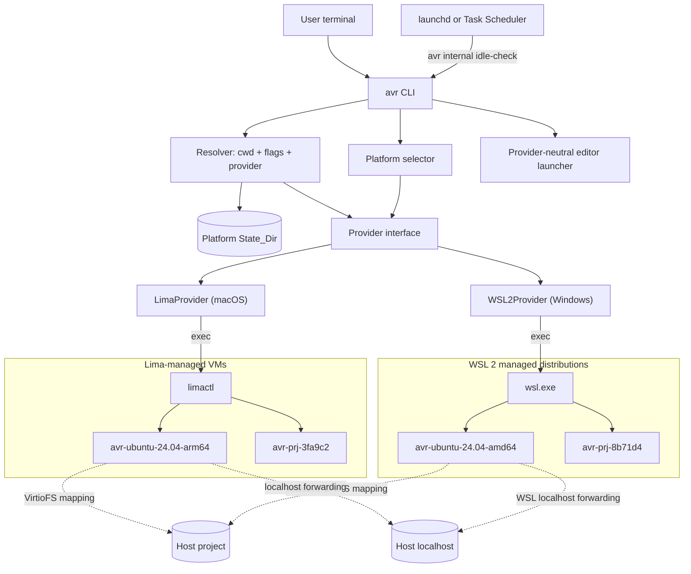

| Snapshot | Terminate if needed, then `wsl.exe --export <name> <snapshot.vhdx> --format vhd`; store a metadata sidecar with machine, provider, selector and capture time; restart if previously running. The flag is `--format vhd` and not `--vhd`: the tool reserves `--vhd` for an import, where it means "the file is a disk rather than a tar" (verified against WSL 2.7.12). A disk rather than a tar because a tar loses permissions, symbolic links and sparse files, and a restored environment that is subtly not the one captured is worse than none. |
| Restore | Read the snapshot before destroying anything, then `--unregister` and `--import <name> <dir> <snapshot.vhdx> --vhd`. WSL has no in-place restore. The import copies the disk into the install location rather than registering the file where it lies, so the same snapshot can be restored from again. |# Design Document — avar (`avr`)

## 1. Overview

avar is a single Go codebase that presents a **directory-centric, shell-first** interface over provider-managed Linux environments. It ships a macOS binary backed by Lima and a Windows binary that selects WSL 2 automatically. Every design decision follows from one product rule:

> The user thinks in terms of "current directory + selected operating environment." Machines, WSL distributions, mounts, transports, and images are avar's problem, never the user's.

### Key architectural decisions

| Decision | Choice | Rationale / trade-off |
|---|---|---|
| Host/provider routing | **`darwin` → LimaProvider; `windows` → WSL2Provider; unsupported hosts fail before dependency work** | Provider choice follows the host, not a user-visible flag. This keeps the command grammar identical and prevents Windows-specific branches from spreading through `cmd/` (Req 18.1, 18.14). |
| macOS backend | **Lima, driven via `limactl` subprocess** | Lima (Apache-2.0, CNCF incubating) already provides VM lifecycle, VirtioFS mounts, automatic localhost port forwarding, snapshots, and clone. Driving the CLI (vs importing Lima's Go packages) decouples avar from Lima's internal API churn. Cost: we parse `limactl` JSON output and depend on CLI stability, mitigated by a minimum-version check (Req 8.4). |
| Windows backend | **WSL 2, driven via `wsl.exe`; avar imports and owns dedicated distributions** | WSL 2 is already the Windows-native Linux runtime. Importing avar-owned root filesystems gives deterministic names, users, configuration, reset, and isolation without changing a user's existing WSL distributions (Req 18.2, 18.7). |
| Backend coupling | **Capability-segregated `Provider`; LimaProvider and WSL2Provider implement the same core contract** | Command-layer code references neither Lima nor WSL. Future OrbStack/SSH/cloud providers slot in without changing the CLI (Req 17.3, 18.14). |
| Environment model | **One shared environment per (provider, distro, arch); per-project environments only under `--isolate`** | Including provider in identity prevents cross-host collisions. Shared-by-default gives instant warm starts and package persistence; isolation is opt-in and remembered per project (Req 4.3, 11, 18.6). |
| VM stack per arch | **Host-native arch → `vmType: vz` (+ Rosetta binfmt enabled); foreign arch (`--arch amd64` on Apple Silicon) → `vmType: qemu`** | vz gives VirtioFS and near-native speed. Rosetta inside the arm64 VM covers "run this x86 binary" cheaply; a full qemu x86_64 VM covers "the whole OS must be amd64," with a one-time performance warning (Req 4.6). |
| File sharing | **Provider-neutral `MountSpec{HostPath, GuestPath}` mappings** | Lima maps both paths identically. WSL disables automatic drive mounting in avar-owned distributions and mounts only registered project paths through DrvFS at `/mnt/avr/projects/<name>-<Project_Identity prefix>`. This preserves live edits without pretending `C:\...` can equal a Linux path (Req 6, 9.3, 18.5). |
| Shell transport | **Lima: `limactl shell`; Windows: `wsl.exe --distribution … --cd … --exec …`** | Both transports remain behind `Provider.Shell`, inherit console streams directly, and return guest exit codes without shell-string interpolation (Req 1–3, 18.8). |
| State | **Versioned flat files in the platform State_Dir** | `~/.avr/` on macOS and `%LocalAppData%\avar\` on Windows. Human-inspectable records plus atomic replace and an operation journal give crash recovery without a database (Req 17.5, 18.12–18.13). |
| No daemon | **avar is CLI-only; idle checks use a per-user OS scheduler** | `launchd` on macOS and Task Scheduler on Windows invoke the same internal command. No resident avar service is introduced (Req 5.5). |
| Language / CLI framework | **Go + `spf13/cobra`** | Single static binary, fast startup, first-class subprocess/PTY handling, same ecosystem as Lima itself. |

### Technology stack

- **Go 1.23+**, `spf13/cobra` (CLI), `golang.org/x/term` (TTY detection/raw mode), `creack/pty` only if needed for tests.
- **Lima ≥ 1.0** (minimum version pinned in code; checked at startup).
- **Windows 11 22H2+**, x64 or Arm64, with the current Store-delivered WSL whose version and required flags pass capability probes. Windows 10 is outside the first WSL2Provider support matrix.
- **Distribution**: GoReleaser → GitHub Releases; Homebrew tap (`brew install --cask olamide226/tap/avar`, cask depends on `lima`) for macOS; checksummed `avr.exe` zip archives for Windows, also submitted to winget as `olamide226.avar` (a portable package, through a pull request to `microsoft/winget-pkgs` from a fork) with no WSL dependency declared, because WSL setup stays behind avar's own explained first-run offer (Req 18.3, 18.15).

### WSL research basis

The Windows design uses only documented platform behavior:

- Microsoft documents `wsl --install`, `--update`, `--status`, `--version`, `--list --verbose`, per-distribution `--terminate`, and destructive `--unregister`, plus WSL 2-only VHD export/import operations in the [WSL command reference](https://learn.microsoft.com/windows/wsl/basic-commands).
- WSL 2 is a real Linux kernel inside a Windows-managed utility VM, while distributions remain separately registered environments ([WSL architecture](https://learn.microsoft.com/windows/wsl/about)).
- Windows files are available to WSL through DrvFS, but Microsoft recommends Linux-native storage for Linux-heavy workloads because `/mnt/<drive>` access is slower ([filesystem guidance](https://learn.microsoft.com/windows/wsl/filesystems)).
- Windows-to-WSL localhost forwarding is automatic on normal WSL 2 installations; mirrored networking improves bidirectional and VPN behavior on Windows 11 22H2+ ([networking guidance](https://learn.microsoft.com/windows/wsl/networking)).
- VS Code accepts a WSL remote authority in the form `wsl+<distro name>` ([VS Code CLI](https://code.visualstudio.com/docs/configure/command-line)).

### Additional editors research basis (Req 13.5–13.9)

Neither editor was installed on the host this was designed on; what follows is from documentation and source, and the parts not yet exercised against the real editors are listed as such in the PR that introduced them.

- **Cursor** is built from VS Code and keeps its launcher: `cursor --remote ssh-remote+<host> <path>` is the form Cursor staff treated as supported when a regression broke it in 1.6.14 and was fixed in 1.6.26 ([forum report](https://forum.cursor.com/t/cursor-remote-ssh-remote-open-undesired-cli-agent/133654)). Cursor's WSL windows use the same `vscode-remote://wsl+<distro>` authority ([forum report](https://forum.cursor.com/t/cursor-deep-links-to-wsl-files-no-longer-reuse-the-existing-cursor-wsl-window-and-now-open-a-new-window/158160/5)), served by its own `anysphere.remote-ssh` / `anysphere.remote-wsl` extensions rather than Microsoft's. Cursor 3's Agent Window does not attach to WSL; the Editor Window does ([forum report](https://forum.cursor.com/t/cursor-3-extension-wsl-is-required-to-open-the-remote-window/156531)).
- **Zed** opens an SSH project with `zed ssh://[<user>@]<host>[:<port>]/<path>`, shells out to the `ssh` on PATH, and inherits `~/.ssh/config` for the host ([remote development](https://zed.dev/docs/remote-development), [CLI reference](https://zed.dev/docs/reference/cli)). The URL is parsed with the `url` crate and its path percent-decoded (`crates/zed/src/zed/open_listener.rs`), so avar percent-encodes the path and names only the host alias, leaving user, port and key to avar's stanza.
- **Zed on Windows** opens WSL folders natively. Its CLI has a Windows-only `--wsl [<user>@]<distro>` flag (`crates/cli/src/main.rs`, added in zed-industries/zed#37035) that the `zed` script Zed installs for use inside WSL passes on every invocation (`crates/zed/resources/windows/zed.sh`). It is not in the public CLI reference, and its help text says it is not meant to be filled in by hand; avar uses it without a user, which selects the distribution's default user, as VS Code's `wsl+<distro>` does. This is the one editor interface avar relies on that its vendor does not document.

## 2. Architecture



### Primary data flow — `avr` (interactive) and `avr <cmd>` (one-shot)

1. **Parse**: `internal/cli.Parse` splits argv — avar's selector flags up to the first non-flag token; everything after is the guest command (Req 2.5). `--` forces the boundary (Req 2.6).
2. **Select provider**: `internal/platform` maps the host OS to one provider ID (`lima` or `wsl2`). Unsupported hosts fail before state or dependency mutation.
3. **Resolve**: `Resolver` computes the Environment_Selector from flags → project record → the project's `.avr.toml` → defaults (§3.11) and includes ProviderID in environment identity. Project_Identity hashes the platform-canonical host path (§3.2).
4. **Ensure deps**: the selected dependency checker validates Lima on macOS or WSL 2 on Windows; no unrelated runtime is checked or installed.
5. **Plan mapping**: the provider maps `(project root, cwd)` to a `MountSpec` plus GuestCwd. Lima preserves the path; WSL uses a deterministic root beneath `/mnt/avr/projects/`.
6. **Ensure environment**: Provider creates (first use) or starts the target and reconciles the desired mount set. Slow or restart-requiring work is explained through `ProgressSink`.
7. **Attach**: `Provider.Shell` applies the explicit environment policy and starts the interactive shell or one-shot argv at GuestCwd. No command is assembled as a shell string; the guest exit code is propagated.
8. **Record**: session start/end is stored in the platform State_Dir, driving idle stop and `avr status`.

## 3. Components and Interfaces

### 3.0 Package layout and dependency direction

Shared vocabulary lives in **`internal/types`**: `ProviderID`, `EnvironmentSelector`, `Arch`, `Distro`, `MountSpec`, the persisted records (`ProjectRecord`, `MachineRecord`, `SessionRecord`), `MachineStatus`, and the `ProgressSink` contract. It holds data definitions and validation only — no I/O, subprocess execution, or output — and imports no other avar package.

This exists because `internal/state` must persist a selector while `internal/resolve` must read a project record: putting either type in the other's package creates a cycle. Dependencies therefore point inward:

```
cmd/  ─────────────────┐
  ├── internal/cli     │
  ├── internal/platform│
  ├── internal/resolve ├──> internal/types
  ├── internal/state   │
  ├── internal/deps    │
  └── internal/provider┘   (provider/lima, provider/wsl2, provider/fake implement it)
```

`internal/tomlsubset` is the strict TOML-subset reader both configuration files share (§3.3, §3.11). Like `internal/types` it imports no other avar package; each file's schema stays with the package that owns the file.

`internal/platform` is the only place allowed to branch on `runtime.GOOS`; it returns a provider factory, dependency checker, State_Dir resolver, and background-scheduler adapter. `internal/provider` owns `Provider` and its operation structs because they describe backend operations rather than shared vocabulary. Nothing in `cmd/` or `internal/resolve` may reference Lima, WSL, `limactl`, or `wsl.exe` (Req 17.3, 18.14).

### 3.1 Command Layer (`cmd/`)

**Purpose**: Map the user-facing grammar onto internal services. Owns all output formatting; nothing below it prints to the terminal (except streamed guest I/O).

**Grammar** — owned by `internal/cli.Parse`, a pure function over argv, **not** by cobra's flag parser:

```
avr [selector flags] [--] [COMMAND [ARGS...]]     # no COMMAND → interactive shell
avr [selector flags] status | stop [--all] | code | cursor | zed
avr [selector flags] ports [--all] | open PORT         (Post-MVP, Req 16)
avr [selector flags] init                              (Post-MVP, §3.11)
avr snapshot [NAME] | restore NAME | reset [--yes]     (Phase 2)
avr isolate off [--yes]                                (Phase 2)
avr destroy [--yes] [--all | --orphaned]               (Phase 2)

Selector flags: --arch arm64|amd64   --distro NAME[:VERSION]   --isolate | --shared
Forwarding flags (Phase 2): --env NAME[=V] (repeatable)  --env-file PATH  --ssh-agent
```

Subcommand-vs-guest-command resolution (Req 2.5/2.6): after selector flags, if the next token is a known avr subcommand it wins; `--` always forces guest execution. This is deterministic and documented in `avr --help`.

**Why not cobra** (amended after implementation): the root command sets `DisableFlagParsing: true` and delegates to `internal/cli.Parse`. Two reasons the original `SetInterspersed(false)` plan failed in practice:

- pflag consumes the `--` token, so recovering the Req 2.6 boundary means threading `ArgsLenAtDash()` through the command layer — the one rule that must be unambiguous becomes a side effect of a framework's internals.
- With cobra parsing on the root, an unimplemented subcommand's flag is rejected before its command exists: `avr stop --all` errors until task 10 lands.

Parsing in a pure function makes the split deterministic and fuzzable (Property 9) and keeps it out of reach of framework behaviour. Cobra still renders help and routes avar's own subcommands; the selector flags are declared on the root purely so `avr --help` documents them.

`internal/cli.Parse` returns an `Invocation` carrying the validated-but-not-defaulted `Selector`, the `Mode` (shell / guest command / subcommand), the subcommand and its unparsed args, the verbatim guest argv, and the help/version intents. Supplying defaults and resolving the distro/version matrix is the resolver's job (§3.2), not the grammar's.

**Exit codes**: `2` for a command line avar cannot read (unknown flag, missing flag value, unsupported `--arch`/`--distro`), distinguishing "avar could not understand you" from `1`, "the operation failed". Req 4.4 requires only non-zero; this is the finer convention avar adopts.

**Does not**: branch on host OS, talk to `limactl`/`wsl.exe`, or read/write state files directly.

### 3.2 Resolver (`internal/resolve`)

**Purpose**: Turn (ProviderID, cwd, flags, state, the project's optional `.avr.toml` through an injected reader, §3.11) into a fully specified selector plus target environment name. Provider-specific host-to-guest path mapping happens after resolution through `Provider.MapProjectPath`.

```go
type EnvironmentSelector struct {
    Distro   Distro   // ubuntu | debian | fedora (+ pinned version)
    Arch     Arch     // arm64 | amd64
    Isolated bool
}

type ResolvedTarget struct {
    Provider     ProviderID
    Selector    EnvironmentSelector
    MachineName string      // deterministic within ProviderID
    Project     ProjectRecord
    HostCwd     string      // canonical host path; never passed directly to a guest
}

func Resolve(provider ProviderID, cwd string, flags Flags, st *state.Store) (ResolvedTarget, error)
```

**Environment naming** (deterministic within a provider; the avar prefix is also the ownership marker):

- Shared: `avr-<distro>-<version>-<arch>` → `avr-ubuntu-24.04-arm64`
- Isolated: `avr-prj-<first 10 hex of Project_Identity>-<distro>-<version>-<arch>` → `avr-prj-3fa9c2b1d0-ubuntu-24.04-arm64`

*(Amended during task 4.* The isolated name originally omitted the environment, which made a project's isolated machine identified by the project alone. An isolated environment is derived from a clean base image of **the selected** (distro, arch) — Req 11.1 — so the environment is part of what identifies it: without it, `avr --isolate --distro fedora` in a project already isolated on Ubuntu resolves to the existing Ubuntu machine and silently hands the user the wrong distribution (Req 4.2). It also keeps isolation consistent with Req 4.3, where each distinct (distro, arch) already gets its own machine. The project hash still guarantees the name is stable from any depth within the project. Longest name in the current matrix: 37 characters.)*

**Precedence**: explicit flags > project record (remembered isolation, Req 11.2) > the project's `.avr.toml` (distro/arch only, §3.11) > built-in defaults (ubuntu 24.04, host-native arch, shared). The State_Dir `config.toml` supplies no distro or arch default (§3.3). On WSL2Provider, a foreign architecture fails capability validation before any environment is created (Req 18.6).

**Project identity**: macOS keeps `EvalSymlinks(abs(cwd))`. Windows first resolves the volume and final path, converts separators to `\`, removes non-root trailing separators, normalizes drive-letter/UNC casing using case-insensitive comparison semantics, and hashes a prefixed key such as `windows:c:\users\ola\code\app`. Display casing remains in `ProjectRecord.Path`; only `PathKey` is normalized. This prevents `C:\Code\App`, `c:/code/app`, and equivalent separator spellings from creating different records (Req 18.13).

**Rationale**: a pure function over explicit provider, path, flags, and state inputs makes selection unit-testable and makes Property 2 deterministic on both host families.

### 3.3 State Store (`internal/state`)

**Purpose**: Durable, crash-consistent record of everything avar knows. All writes are atomic and guarded by a per-user advisory lock so concurrent invocations serialize state mutations (Req 17.5, 18.12).

Layout:

```
<State_Dir>/                    # ~/.avr on macOS; %LocalAppData%\avar on Windows
  schema.json        # state schema version + completed migrations
  config.toml        # the user's hand-edited settings: idle_timeout, forward_env (below)
  projects.json      # Project_Identity → ProjectRecord
  machines.json      # machines avar created: name → MachineRecord
  sessions.json      # live session pids per machine (idle-stop input)
  operations.json    # pending create/restore/delete journal for crash recovery
  ssh/config         # avar-owned SSH host entries (avr code), included via Include
  distros/           # WSL install roots; Windows only
  snapshots/         # provider snapshot artifacts and metadata
  logs/              # provisioning logs (referenced in error messages)
```

Windows uses `ReplaceFile`/`MoveFileEx` semantics for atomic replacement rather than assuming POSIX `rename`; directory creation grants only the current Windows user and administrators access. State schema v2 migrates existing `Mounts []string` entries into `MountSpec{HostPath: p, GuestPath: p}` and `VMType` into `Runtime`, assigning `Provider: "lima"` to pre-Windows records.

`operations.json` records intent before an external create, restore, or destructive unregister. A reconciler may adopt or remove an unrecorded backend environment only when a matching pending operation and on-guest avar marker prove ownership. A name prefix alone never authorizes mutation.

#### `config.toml`: the user's own settings, read exactly (Req 17.7)

`config.toml` is optional, written only by the user, and never by avar. Its schema is closed and has two keys, which are the two settings the code reads from it:

```toml
idle_timeout = "2h"                # Go duration; "0" disables idle stop (Req 5.5, §3.8)
forward_env  = ["AWS_PROFILE"]     # standing grant of host variables to every session (Req 12.4, §3.10)
```

`state.Store.Config` reads it with `internal/tomlsubset`, the strict reader `.avr.toml` uses (§3.11), and returns a `state.Config`. A missing file is the zero `Config`, which means avar's defaults. `idle_timeout` accepts a quoted Go duration, plus two forms files written for the lenient reader used with the meaning intended: the integer `0` and a negative duration, both of which disable idle stop. A `forward_env` name must be a portable variable name (`types.CheckVariableName`, shared with `.avr.toml`); a name listed twice is kept once, because the list has only ever been read as a set. `distro`, `arch`, `cpus`, `memory` and `packages` are refused with a message saying they are not supported in `config.toml` and where to set them instead, rather than as unknown keys, since writing one there is a reasonable guess and not a typo. Global distro and arch defaults remain a possible future layer (§3.11 precedence); they are not accepted until they do something.

**Maintainer decision, 2026-09-17: fail rather than guess.** This file was previously read by two hand-rolled readers, `state.parseConfigList` and `session.parseTOMLKey`, which were deliberately lenient on the principle that a typo in the user's own file must never stop a shell. That principle produced silent misreads, each confirmed in code and each proven by a test that failed against it: a misspelt key such as `idle_timout` was ignored; `parseTOMLKey` matched only the literal prefix `idle_timeout = `, so `idle_timeout="0"` left auto-stop on; and `parseConfigList` split on every comma, so `forward_env = ["A,B"]` granted two variables nobody listed. A setting that silently does not apply is worse than a command that stops, because the user believes it is in force. The readers were replaced, not repaired.

When the file cannot be read exactly:

- **Every command refuses before any machine work** — before resolving, which would register a project — with exit 1, the file's full path, the line, the key, what to write instead, and a suggested key when the unknown one is a near miss (edit distance ≤ 1, or ≤ 2 for keys of eight letters or more). The check lives in `cmd` dispatch (`checkUserConfig`) so that no command can forget it, and `App.Config` caches the one read so the command's own use sees the same parse.
- **`help` and `version` still work.** They are answered before dispatch and never read the file.
- **`status`, `stop` and `destroy` still work,** after printing the error and saying that other commands, and idle stop, are paused until the file is fixed. None of them reads a setting from the file, and a broken setting must not stop the user from seeing or releasing what avar is running. `reset`, `snapshot`, `isolate` and the rest are refused: they are not needed to recover, and the maintainer's default is to fail.
- **The scheduled idle check stops nothing and exits non-zero.** Nobody is watching it, and no guess is safe: falling back to the two-hour default would stop the environments of the user whose broken line was `idle_timeout = "0"`. The non-zero exit is recorded by launchd or Task Scheduler as the last result, and the next interactive `avr` names the line. Idle stop resumes on the first check after the file is fixed.

**Does not**: know how Lima or WSL operates. Backend reality (`limactl` or `wsl.exe`) remains the source of truth; the provider reconciles that reality with avar's records and operation journal.

### 3.4 Provider Interface (`internal/provider`)

**Purpose**: Backend abstraction (Req 17.3, 18.14). Command orchestration depends only on this interface; the Resolver depends only on shared types.

The operations are **segregated by capability** rather than gathered into one interface. `Provider` is the core set every backend must implement; `Snapshotter`, `EditorTargetProvider`, `PortDiagnoser`, `MachineSizer`, and `SSHAgentForwarder` describe optional abilities. Callers type-assert for a capability and report plainly when it is absent. Editor launch is modeled by a transport-neutral target, so WSL is not forced through SSH.

```go
type Provider interface {
    ID() types.ProviderID

    // MapProjectPath converts a canonical host project/cwd pair into the mount
    // the backend must apply and the working directory Shell must receive.
    // It is deterministic and performs no external mutation.
    MapProjectPath(projectID, hostRoot, hostCwd string) (mount MountSpec, guestCwd string, err error)

    // EnsureMachine creates the machine if absent, starts it if stopped, and is a
    // silent no-op when it is already running (Req 1.2/1.3 — called every invocation).
    // On failure nothing half-created survives (Req 1.6, Property 7).
    // Emits Creating / Starting / Warning (emulation, Req 4.6) events.
    EnsureMachine(ctx context.Context, spec MachineSpec, progress types.ProgressSink) error

    // Shell attaches an interactive shell (empty Argv) or runs argv on an
    // already-running machine, and returns the guest exit code. A non-zero guest
    // status is (code, nil) — never a Go error (Req 1.7/2.2, Property 3).
    // Streams stdio; allocates PTY iff opts.TTY; forwards SIGINT/SIGTERM/SIGWINCH.
    // Takes no ProgressSink: once attached, avar is silent.
    Shell(ctx context.Context, machine string, opts ShellOpts) (exitCode int, err error)

    // Mounts. SetMounts takes the complete desired set and replaces what is applied,
    // which is what makes mount confinement checkable (Property 5). Idempotent: an
    // unchanged set means no restart (Req 17.1).
    AppliedMounts(ctx context.Context, machine string) ([]MountSpec, error)
    SetMounts(ctx context.Context, machine string, mounts []MountSpec, progress types.ProgressSink) error

    Stop(ctx context.Context, machine string, progress types.ProgressSink) error // stopped → no-op; unknown → ErrMachineNotFound
    Delete(ctx context.Context, machine string) error                            // fully idempotent (cleanup path, Property 7)
    Status(ctx context.Context) ([]types.MachineStatus, error)                   // avar-owned machines only, sorted (Req 5.4, Property 6)
}

// Phase 2 capabilities, implemented only by backends that actually have them.
type Snapshotter interface {
    Snapshot(ctx context.Context, machine, name string, progress types.ProgressSink) error
    RestoreSnapshot(ctx context.Context, machine, name string, progress types.ProgressSink) error
    ListSnapshots(ctx context.Context, machine string) ([]SnapshotInfo, error)
}

type EditorTargetProvider interface {
    EditorTarget(ctx context.Context, machine, guestPath string) (EditorTarget, error)
}

// PortDiagnoser explains forwarding state (Req 7.2) and is what `avr ports` and
// `avr open` are built on (Req 16). Forwarding itself is not an operation — it
// happens without avar asking — so there is only something to report. Every
// entry describes a port a guest process is listening on now: a forward the
// backend once logged whose listener has closed is not reported (Req 7.3, 16.2).
type PortDiagnoser interface {
    PortDiagnostics(ctx context.Context, machine string) ([]PortDiagnostic, error)
}

type PortDiagnostic struct {
    GuestPort int
    HostPort  int    // zero when nothing was published; normally equal to GuestPort
    Forwarded bool   // reachable from host localhost now
    Reason    string // why not, when !Forwarded
    PID       int    // guest process listening, where determinable (Req 16.1)
    Process   string // its command line; empty when not determinable
}

// MachineSizer marks a backend that gives each machine its own CPU and memory
// allocation, so MachineSpec.CPUs/MemoryGB mean something there (§3.11).
// WSL 2 runs every distribution in one globally sized VM and does not implement it.
// A backend that sizes machines also reports what it sizes them against, so an
// oversized request is refused before any machine work (Req 15.5, Property 25).
// The capacity is never estimated: an unreadable one is an error.
type MachineSizer interface {
    HostCapacity(ctx context.Context) (types.HostCapacity, error) // logical CPUs, physical memory in bytes
}

// SSHAgentForwarder marks a backend whose Shell honours ShellOpts.ForwardSSHAgent
// (Req 12.3). Lima implements it; WSL 2 does not, and its Shell refuses the
// request with ErrUnsupportedCapability rather than dropping it. The command
// layer asserts it before any machine work and refuses `--ssh-agent` when it is
// absent, because a credential grant that silently does not happen is the worst
// failure the flag has.
type SSHAgentForwarder interface {
    ForwardsSSHAgent() // a declaration, not an operation
}

type MachineSpec struct {
    Name       string                     // avr-…, from the resolver (ownership marker)
    Provider   types.ProviderID
    Selector   types.EnvironmentSelector
    Kind       types.MachineKind          // shared | isolated | base
    Mounts     []MountSpec                 // provider-planned host → guest mappings
    CPUs       int                        // zero → backend's host-proportional default (Req 17.4); non-zero honoured only by a MachineSizer
    MemoryGB   float64
    DiskGB     float64
    DeriveFrom string                     // optional pristine base to copy (Req 11.1); a hint, not a requirement
}

// MountSpec is shared vocabulary and lives in internal/types (§3.0, §4): the
// state store persists it and the resolver reads it, so it cannot live in
// internal/provider. It is reproduced here because the signatures above are
// unreadable without it; the declaration itself is types.MountSpec.
type MountSpec struct {
    ProjectID string
    HostPath  string // canonical host path
    GuestPath string // absolute Linux path chosen by Provider.MapProjectPath
    Writable  bool
}

type ShellOpts struct {
    Workdir string            // guest path, never a raw Windows path
    Argv    []string          // empty → interactive login shell
    Env     map[string]string // ONLY what policy explicitly allows; never merged with the
                              // host environment (Req 9.1/12, Property 4)
    TTY     bool
    Stdin   io.Reader         // nil → the calling process's stream; redirection is invalid with TTY.
    Stdout  io.Writer         // Used by avar's own guest probes (e.g. mount verification, Req 6.5)
    Stderr  io.Writer         // so their output never reaches the user's terminal.
    ForwardSSHAgent bool      // honoured only by an SSHAgentForwarder; refused by any other backend
}

type EditorTarget struct {
    Authority string // ssh-remote+<alias> or wsl+<distribution>
    GuestPath string
    SSHConfig string // optional; populated by Lima, empty for WSL
}
```

`MapProjectPath` rules:

- Lima: `HostPath == GuestPath`; GuestCwd is the host cwd.
- WSL: the project root maps to `/mnt/avr/projects/<name>-<Project_Identity prefix>` and GuestCwd appends the validated relative path from project root to host cwd. Path traversal outside the root is rejected.

Sentinel errors (`ErrNotOwned`, `ErrMachineNotFound`, `ErrMachineNotRunning`, `ErrSnapshotNotFound`, `ErrUnsupportedCapability`, `ErrRestartRequired`) let orchestration react to conditions instead of matching message text; §6 maps them onto user-facing behavior.

### 3.5 LimaProvider (`internal/provider/lima`)

**Purpose**: Implement `Provider` by shelling out to `limactl`.

Key mappings:

| Provider op | limactl mechanism |
|---|---|
| Create machine | `limactl start --name <n> --tty=false <generated .yaml>` — avar generates a full Lima config from an embedded template per (distro, arch): base image URL (pinned, checksummed), `vmType` (vz native / qemu foreign), `rosetta: {enabled,binfmt}: true` on vz+arm64, CPU/mem/disk from Req 17.4, mounts list, `mountType: virtiofs` (vz), provision script (create user matching host username + NOPASSWD sudo — Lima does this by default). |
| Start | `limactl start <n> --tty=false` |
| Shell | `limactl shell --workdir <cwd> <n> -- <argv>`; avar wraps with env policy (env vars passed as `FOO=bar` arguments to the guest's `env`, which `limactl shell` quotes correctly) and inspects the child's exit code (`limactl shell` propagates the remote exit status). **An interactive session passes an argv too** — `sh -c 'exec env -- "$@" "$SHELL" -l' sh NAME=value …` — because `limactl shell` with no argv runs the login shell with nowhere to put an environment, which silently dropped every REQ-12 grant from `avr` while one-shot commands kept theirs. The assignments are positional arguments to a constant script, so no value is ever parsed as shell syntax, and `"$SHELL"` is expanded before the grant applies, so the shell exec'd is the account's own even when the grant names SHELL. Verified against Lima 2.2.0: Lima runs any argv as `cd <workdir> \|\| exit 1 ; exec "$SHELL" -l -c '<argv>'`, so the profile is read by that shell and again by the interactive login shell this execs — which means a profile that assigns a granted name unconditionally wins in an interactive session, as it does for any variable present at login. |
| Mounts | Read: `limactl list <n> --json` (`.config.mounts`). Write: `limactl edit <n> --set '.mounts = [...]' --tty=false`, then stop/start if running. |
| Port forwarding | Nothing to do — Lima's hostagent auto-forwards guest-localhost TCP ports to host localhost and releases them on close (Req 7.1/7.3). `PortDiagnostics` joins two sources: the hostagent log (`ha.stderr.log`) says what was forwarded or refused (Req 7.2), and the shared guest listener script (`internal/provider/listeners`, run unprivileged through `limactl shell`) says what is listening now and which process holds it (Req 16.1). Only ports on both are reported. **The log alone is not a current picture** — verified against Lima 2.2.0, whose gRPC forwarder logs the end of a forward as `removing listener for hostAddress: …, guestAddress: …` with no protocol, so a closed TCP forward cannot be read out of it. The guest is entered only when the log has something to confirm, so an idle machine costs `avr status` no round trip. `Not forwarding` lines for loopback addresses other than 127.0.0.1/::1 (systemd-resolved's 127.0.0.53/54, logged on every Ubuntu start) are Lima's rules working, not conflicts, and are not reported. |
| Stop / Delete | `limactl stop <n>` / `limactl delete <n>` |
| Snapshot / Restore | `limactl snapshot create/apply/list <n> --tag <name>` (instance is stopped first if the operation requires it, then restarted if it was running). **QEMU only** — verified against Lima 2.2.0, where every snapshot subcommand exits `unimplemented` on a `vz` instance. The provider checks the machine's `vmType` and returns `ErrUnsupportedCapability` before touching it, so the refusal costs nothing and explains itself. This is why `Snapshotter` is a capability interface *and* why a successful type-assertion is not sufficient: the same provider can snapshot an emulated machine and not a native one. |
| Isolated create (fast path) | Keep a pristine, stopped base machine per (distro, arch) (`avr-base-<distro>-<ver>-<arch>`); `limactl clone` it for `--isolate` (clone copies disk + ssh config verbatim, so it is fast and deterministic). Fallback: full provision if no base exists. |
| Reset | `limactl delete <n>` + re-create from template/base (Req 10.3). |
| SSH config | Read Lima's generated per-instance `~/.lima/<n>/ssh.config` and re-emit it into `~/.avr/ssh/config` under host alias `avr-<machine>`. **Not `limactl show-ssh`**: verified deprecated in Lima 2.2.0, which prints a warning directing callers to `ssh -F ~/.lima/<n>/ssh.config lima-<n>`. Building `avr code` (task 19) on a deprecated command would inherit its removal. |

**Mount-change restart policy** (Req 6.4): mount edits requiring restart are expected to be rare (first `avr` in each new project). The provider reports a `ProgressSink` event ("Adding /Users/you/code/newproj to your Linux environment — one-time restart, ~10s") so the UX cost is explained. Registered mounts accumulate in the machine config, so revisiting any known project is instant.

**Ownership guard** (Req 5.4): **mutating** operations validate that the machine name has the `avr-` prefix *and* appears in `machines.json`. Recovery of an interrupted create additionally requires a matching operation-journal entry.

**`Status` filters on the prefix alone** — deliberately weaker, and amended after implementation. Filtering the listing by registry membership as well makes a machine avar created but never finished recording invisible, which is precisely the damage a crash mid-create leaves and precisely what reconciliation (§3.3) exists to adopt. With the stricter filter, adoption is unimplementable. Req 5.4's own wording is prefix-based ("identified by an avar naming prefix/label"), so prefix-only listing is the requirement-faithful reading. Listing is how avar *discovers* damage; mutating is how it *acts* on it, and only the latter needs the record.

`Status` populates `Kind` and `Selector` for unrecorded machines as far as the listing and the deterministic name allow, leaving unknown fields zero rather than guessing — an orphan the reconciler cannot attribute is left alone, never filed under a guessed project.

**Machine state mapping**: a machine that is *coming up* (Lima `Installing`/`Uninitialized`) must map to its own `types.MachineState` value, never to `StateBroken` or `StateUnknown`. Reconciliation deletes unrecorded machines in those two states, and an in-flight create has no record yet: collapsing "starting" into "broken" lets one invocation delete the machine another is still creating. Unrecognised state values are left alone by design, which is what makes a distinct value safe.

### 3.6 WSL2Provider (`internal/provider/wsl2`) — Post-MVP

**Purpose**: Implement the existing Provider contract on supported Windows hosts by driving `wsl.exe`, while owning dedicated imported WSL 2 distributions and never mutating distributions the user installed independently (Req 18).

**Support matrix**: Windows 11 22H2+ on x64 and Arm64, with Store-delivered WSL passing `wsl --version` and CLI capability probes. Each WSL environment uses the host-native architecture only. `--arch amd64` on Arm64 and `--arch arm64` on x64 return `ErrUnsupportedCapability` before download or import.

**Provisioning model**:

1. Select a pinned, checksummed official rootfs artifact from the same distro/version matrix used by Lima.
2. Write a `create` intent to `operations.json`, download into the State_Dir cache, and verify SHA-256 before import.
3. Run `wsl.exe --import <avr-name> <State_Dir>\distros\<avr-name> <rootfs.tar> --version 2`.
4. Provision as root: create a sanitized Linux username derived from the Windows account, grant passwordless sudo, write `/etc/avar/managed.json` (provider, avar name, selector, image digest), and configure `/etc/wsl.conf` with that default user, systemd enabled, Windows PATH injection disabled, and automatic drive mounting disabled.
5. Terminate and restart only that distribution so `wsl.conf` takes effect; verify WSL version 2, marker identity, non-root default user, passwordless sudo, and an empty applied-mount set.
6. Commit `MachineRecord` and clear the operation journal. Any failure unregisters the partial avar distribution, removes its install directory, and leaves no machine record.

Using imported distributions avoids first-launch username prompts and prevents avar from adopting or modifying `Ubuntu`, `Debian`, or any other user-managed registration. The default user for an imported distribution is configured through `/etc/wsl.conf`, which Microsoft documents for imported distributions.

**Operation mapping**:

| Provider operation | WSL 2 mechanism |
|---|---|
| List and version check | `wsl.exe --list --quiet`, `--list --running --quiet`, and `--list --verbose`. The parser decodes UTF-16 when present and extracts avar's no-whitespace names plus the numeric WSL version from the right, avoiding localized header/state matching. |
| Start / ensure | A no-output probe through `wsl.exe --distribution <name> --user root --exec /bin/true`; WSL starts a stopped distribution on demand. Marker and WSL-2 checks run on cold start and reconciliation, not every warm attach. |
| Path mapping | `MapProjectPath` maps a registered host root to `/mnt/avr/projects/<name>-<Project_Identity prefix>` and preserves the cwd’s relative suffix. The directory is named for the project before it is identified by its hash: this path is the user’s working directory, and it appears in their shell prompt, their editor’s title bar and every error any tool prints, so sixty-four hexadecimal characters there is a real cost for no correctness gained. The truncation is the same length the resolver already uses to name a per-project machine, and the hash half is never omitted — it is what keeps two projects called `api` distinct (Prop 14). |
| Mounts | Reconcile selective DrvFS mounts as root with argv-safe execution (no interpolated shell string). `/proc/mounts` is the applied source of truth: it is kernel-defined, identical across the supported distributions, and never localized, and it carries the DrvFS options avar plans against. (Amended from `/proc/self/mountinfo`, which the implementation does not read.) **A DrvFS mount is not identified by its filesystem type.** WSL 2 serves DrvFS over 9P, so `/proc/mounts` reports the type as `9p` and names DrvFS only inside the options, as `aname=drvfs` — e.g. `C:\134Users\134ola\134app /mnt/avr/projects/app-a7c3d378e1 9p rw,...,aname=drvfs;path=C:\Users\ola\app;metadata;...`. A predicate must therefore accept either spelling (`$3 == "drvfs"` or `aname=drvfs` among the options), and it must be defined once and shared by every script that asks the question: reading applied mounts and checking confinement are the same question, and a predicate that matches nothing fails silently in both — reporting no mounts applied, and passing a guest with an entire drive mounted. Automatic drive mounting remains disabled, so avar does not expose an entire drive merely to share one project. |
| Shell / command | `wsl.exe --distribution <name> --user <avar-user> --cd <GuestCwd> --exec <argv...>`. The pinned WSL minimum must advertise `--cd`; args are passed as distinct Windows process arguments. Interactive mode execs the user's login shell. |
| Stop | `wsl.exe --terminate <name>`; never `wsl --shutdown`, which would stop user-owned distributions too. |
| Snapshot | Terminate if needed, then `wsl.exe --export <name> <snapshot.vhdx> --format vhd`; store a metadata sidecar with machine, provider, selector and capture time; restart if previously running. The flag is `--format vhd` and not `--vhd`: the tool reserves `--vhd` for an import, where it means "this file is a disk rather than a tar" (verified against WSL 2.7.12). A disk rather than a tar because a tar loses permissions, symbolic links and sparse files, and a restored environment that is subtly not the one captured is worse than none. |
| Restore | Read the snapshot before destroying anything, then `--unregister`, remove the install directory, and `--import <name> <dir> <snapshot.vhdx> --vhd`. WSL has no in-place restore. The import copies the disk rather than registering the file where it lies, so the same snapshot can be restored from again. **Amended:** the earlier design exported a temporary rollback VHDX first and reimported it on failure. That is a full copy of the environment's disk — gigabytes and minutes — paid on every restore to insure against a rare import failure, and the rollback import can fail in exactly the same ways. avar instead makes restore *retryable*: it does not require the distribution to exist, so a failed restore leaves a state the same command recovers from. The residual risk is stated rather than hidden — if the import keeps failing, the pre-restore environment is gone, which is what the user asked for when they asked to restore. |
| Isolated create | Import from a cached clean base export into `distros\<isolated-name>` with `--version 2`, then write a unique marker and mount only that project. |
| Port diagnostics | Run the shared guest listener script (`internal/provider/listeners`) as root — `/proc/net/tcp{,6}` plus a `/proc/*/fd` scan for process attribution, never `ss`, which minimal images lack — then probe each port on Windows `127.0.0.1` concurrently, and report guest-listening/host-unreachable conflicts without modifying global WSL networking. A listener bound only to guest loopback is probed too, because Microsoft documents `localhostForwarding` as covering ports "bound to wildcard or localhost"; it is reported when it answers and omitted when it does not, since whether a loopback bind is published depends on networking mode. (Amended: the earlier implementation skipped loopback binds outright, which would have hidden the dev servers that bind `localhost` by default from `avr ports`.) A host-side answer cannot be attributed to WSL's relay versus a Windows program holding the port; that remains unmeasured and unclaimed. |
| Editor target | Return `EditorTarget{Authority: "wsl+<name>", GuestPath: <path>}`; no SSH stanza is generated (Req 18.10). |

**Terminal behavior**: `wsl.exe` inherits the calling console handles. With a TTY, avar attaches the console and lets Ctrl-C/resize flow through the foreground process group; with redirected stdin/stdout it uses pipes and does not allocate a console PTY. Windows interrupt handling is encapsulated in `internal/provider/wsl2/console_windows.go`; builds for other hosts use platform stubs. Guest non-zero exit status remains `(code, nil)`.

**Security boundary**: avar-owned distributions start with automatic drive mounts and Windows PATH injection disabled, and avar mounts only registered projects. WSL is still a developer convenience boundary, not a hostile-code sandbox: a guest administrator with passwordless sudo can deliberately reconfigure WSL integration. Help and security documentation must state this limitation without weakening avar's default mount policy.

**Native workspace advisory**: `internal/workspace` emits a once-per-project recommendation when a Windows-backed project has a dependency-heavy manifest/lockfile (`package-lock.json`, `pnpm-lock.yaml`, `yarn.lock`, `Cargo.lock`, or equivalent configured detector) or crosses a deterministic file-count threshold. Dismissal is stored in `ProjectRecord`; acceptance routes to Requirement 14, never an implicit copy. (Amended from `internal/workspace/perf`, which the implementation does not have; the detector is `workspace.Detect` and it stats a fixed list of names in the project root rather than counting files, because a walk on the path to a shell is slowest exactly where DrvFS is slowest.) The advisory names `--native-fs` and `avr sync` now that both exist; until they did it deliberately did not, and a test enforced that.

**Native workspace mode (`--native-fs`, Req 14)**: the project gets a second copy on the distribution's own ext4 filesystem at `/home/<user>/workspaces/<name>-<Project_Identity prefix>` — the same readable-then-unique name the share carries, so the two are visibly one project — and the session's working directory becomes that copy. Behind the optional `provider.NativeWorkspacer` capability, so a backend that reaches a project at native speed already (Lima) simply does not implement it and the command layer says so.

*The share is the transport.* The DrvFS mount stays exactly as it is; native mode adds a copy and moves the working directory. Copying is therefore an entirely guest-side operation between two guest paths, so avar needs no file-transfer protocol and no `rsync` — which a minimal image need not have and which avar has no business installing into a user's environment. It also means the security boundary does not move: native mode exposes no host path the share did not already expose (Prop 5).

*Content, never timestamps.* Three SHA-256 manifests — the host copy, the native copy, and a baseline recording what they held when the last synchronization completed — are compared three ways. A file changed on one side only is carried; changed on both to the same bytes is recorded as agreement; changed on both differently is a conflict avar reports and never resolves (14.3). Timestamps are not evidence here: the two copies live on filesystems with different clocks and granularity, on opposite sides of a translation layer. The guest reports the manifests through one `find`/`sha256sum` invocation per scan (one, not three: three would be three different moments); the baseline is `/var/lib/avar/workspaces/<name>.manifest`, inside the guest so it cannot outlive the copy it describes.

*Reviewable and interruptible.* `avr sync` with no direction prints what each direction would do and applies nothing; `--to-host`/`--to-guest` print the same listing and then confirm. Any conflict refuses the whole apply rather than carrying the non-conflicting part, so one of the two copies stays authoritative at every moment. Each file is copied to a temporary name beside its destination and moved into place, and the baseline is written only after every copy and delete has succeeded — so an interrupted synchronization leaves no truncated file and the previous agreement still recorded, and repeating the command converges (Req 17.5). Build-output directories (`node_modules`, `target`, `__pycache__`, `.venv`, and the rest of `types.WorkspaceExcludedDirs`) are never carried in either direction; symbolic links and other non-regular files are reported as unsynchronized rather than silently dropped.

*Working-directory equivalence.* Property 1 continues to quantify over `MapProjectPath`, which native mode does not change. `--native-fs` is the one mode in which the session's directory is deliberately not the mapped mount — the user asked for a copy, and Requirement 14 is what asking for one means.

### 3.7 Dependency Manager (`internal/deps`)

**Purpose**: Validate only the dependency required by the selected provider.

- `deps/lima`: Req 8. `limactl --version` → parse → compare to `MinLimaVersion`. If missing: prompt (default No when non-interactive), run `brew install lima` streaming output, re-verify. If brew is missing or declined: print manual instructions and exit 1.
- `deps/wsl2`: run `wsl.exe --version`, `--status`, and capability probes. If WSL is absent/disabled, explain the elevation and restart implications before offering `wsl.exe --install --no-distribution`. If installed but below the pinned minimum, offer `wsl.exe --update`. Setup actions do not create an avar distribution; a restart-required result returns `ErrRestartRequired` with an idempotent “restart, then rerun `avr`” instruction. A WSL 1 avar registration is rejected with the exact `wsl.exe --set-version <name> 2` recovery command but never converted automatically (Req 18.3–18.4).

### 3.8 Session & Idle Manager (`internal/session`) — Phase 2 for idle stop

**Purpose**: Track active sessions (Req 5.1 "in use", Req 5.5 idle stop) independent of provider.

- On attach, append `{machine, pid, started_at}` to `sessions.json`; remove on exit (defer + best-effort). Stale entries (dead pid) are pruned on every read.
- Idle stop: avar installs (with one-time notice) a per-user scheduled invocation of `avr internal idle-check` every 30 minutes (10 until 2026-09-18, lengthened because each run on Windows then briefly opened a console window): `launchd` on macOS, Task Scheduler on Windows. Registration records the interval as well as the binary (the Windows stamp, the macOS plist's `StartInterval`), so an existing registration at an older interval is replaced on the next invocation. For each running or stopped avar environment with zero live sessions and `last_activity + IdleTimeout < now`, call its recorded Provider's `Stop`, which converges on stopped and releases anything a stopped machine left behind (task 41). `idle_timeout = "0"` disables it, and a `config.toml` that cannot be read stops nothing (§3.3). Registration is checked on every environment-creating invocation for one file read, and repaired when it names a binary other than the running one (the plist's content on macOS, a stamp file on Windows). A launchd agent the user has unloaded is corrected on disk but not reloaded. Flow tests replace registration through `App.scheduleIdleCheck`, so no test reaches the real scheduler. **A binary in the temporary directory is never registered** on either host, and avar says so: the registration would outlive the file (a `go test` binary, a helper a test built, `go run`, an `avr.exe` opened out of a zip). This guard is in `ensureIdleScheduler` itself, in front of both hosts, because the seam protects only the tests that use it; a mutation check of the helper's test once reached the real launchd agent through a spawned process that the seam could not cover (docs/lessons.md).
- Windows Task Scheduler registration uses the current user's token, requires no elevation, and is updated after binary upgrades. Removing avar removes only its named task.
- **Amended 2026-09-18 (Req 5.9): the scheduler follows `idle_timeout`, and a user's deletion sticks.** `ensureIdleScheduler` reads the timeout through `App.Config` (the strict reader, already loaded by dispatch, so the warm path gains no read); a config that cannot be read leaves registration untouched. With `"0"`, macOS unloads and deletes the agent (one stat thereafter) and Windows deletes the task and stamps `not registered: idle_timeout is 0`; each says so once. A timeout set again registers at the next `avr`, with the notice. On Windows, replacing a registration that no longer matches (avr.exe moved, or an older avar made it) first runs `schtasks /Query`; a task that is gone was deleted by the user, who the notice told to do exactly that, so avar stamps `not registered: removed by the user` and never re-creates it. Deleting the stamp undoes that. The query runs only on that path, never on the warm path, a first registration, or re-registering after avar itself removed the task. macOS keeps its existing rule (an agent the user unloaded is corrected on disk but not reloaded); a plist the user deleted is reinstalled, since the notice tells macOS users to `bootout` rather than delete.
- **Uninstall.** Neither package manager runs avar at uninstall, so neither can remove what avar registered itself. The Homebrew cask removes the agent in `zap` (`launchctl: com.avar.idle-check`), not `uninstall`: Homebrew runs the whole `uninstall` stanza on every `brew upgrade` as well (only `signal` is skipped, `cask/artifact/uninstall.rb`), which would drop the agent at each upgrade and halt idle stopping until the next `avr`, and its `launchctl` directive looks the label up with sudo, which can prompt for a password. The cask's caveat names `--zap`. winget's portable uninstall runs nothing of avar's, so the installation notes say to run `schtasks /Delete /TN avar-idle-check /F` first. The README's Uninstall section gives both hosts' commands. A leftover registration is inert: it names a file that is gone, and on Windows a task whose program is missing starts nothing and opens no window.
- **Amended 2026-09-18: the Windows task runs `avrw.exe`, not `avr.exe` (Req 18.16).** `avr.exe` is a console-subsystem program, and Windows gives a console program started in the user's interactive session a console window of its own ("the system creates a new console when it starts a console process", learn.microsoft.com/windows/console/creation-of-a-console), so the task put a window on the desktop, taking keyboard focus, every time it ran; the maintainer confirmed it on a real machine. `avrw.exe` (`cmd/avrw`) is the idle check alone, linked with `-H windowsgui`: "GUI processes are not attached to a console when they are created" (same page). It ignores its arguments. Because it has no console to lend, every console child it starts (`wsl.exe`) would get a new console window instead, so `internal/deps`'s runner sets `CREATE_NO_WINDOW` on children when avar has no console window (`GetConsoleWindow` is NULL); an interactive `avr` shares its console with `wsl.exe` as before.
  - *Considered and rejected: a non-interactive logon.* A task registered "whether the user is logged on or not" runs outside the desktop and shows nothing, and S4U (`/RU <user> /NP`) needs no stored password. But S4U gives "no access to either the network or encrypted files" (learn.microsoft.com, `Principal.LogonType`), and `wsl.exe` is repeatedly reported failing from exactly that setting while working from "Run only when user is logged on" (microsoft/WSL #9133, #2912, #10732; #9271 closed as a duplicate, citing "it's not possible to access wsl from session 0"). No evidence found shows it seeing the user's distributions from S4U, so it was not chosen.
  - *Where the helper is found.* Beside `avr.exe`, as `os.Executable` reports it or with links resolved (winget may link `avr.exe` onto PATH from its package folder), never on PATH. The task's action is the quoted helper path alone.
  - *Migration.* The stamp now records `<avr.exe>\nevery N minutes\nthrough avrw.exe\n`. No stamp an earlier avar wrote matches, so the first environment-creating `avr` after upgrading re-registers with `/Create /F`, silently.
  - *No helper.* Nothing is registered, an existing task is deleted (it runs `avr.exe` and opens the window), and the user is told once, per binary, that idle auto-stop is off and how to turn it on. Registering `avr.exe` instead would keep auto-stop at the cost of a focus-stealing window every run; an environment left running is the smaller, user-recoverable cost. The stamp records the telling, so the warm path stays one read plus, only in this state, a stat for the helper.
  - *Packaging.* GoReleaser builds `avrw-windows` for amd64 and arm64 and puts it in the same zip as `avr.exe`; the winget portable manifest gets a second `NestedInstallerFiles` entry (`avrw.exe`, alias `avrw`), which GoReleaser generates from the archive's binaries.

### 3.9 Editor Launcher (`internal/editor`) — Phase 2, extended post-MVP

**Purpose**: Req 13/18.10. Ensure the environment is running, request an `EditorTarget`, then execute the requested editor's launcher with arguments built from that target.

- `internal/editor.Editor` describes one editor: its display name, its launcher command, platform install guidance, and a function from `(authority, guest path)` to launcher arguments. `cmd/code.go` registers `code`, `cursor`, and `zed` against one shared flow and never branches on the editor or the backend.
- The flow is: refuse arguments → locate the launcher on PATH (before any backend call, Req 13.7) → resolve → ensure the environment → `EditorTarget` → build the launcher arguments (an editor that cannot reach the target is refused here, before anything is written, Req 13.8) → write SSH material if the target carries any → launch.
- `EditorTarget.Authority` is in VS Code's vocabulary (`ssh-remote+<alias>`, `wsl+<distribution>`). VS Code and Cursor take it verbatim as `--remote <authority> <path>`. Zed translates it: `ssh-remote+<alias>` → `ssh://<alias><escaped path>`, `wsl+<distribution>` → `--wsl <distribution> <path>`; any other kind is `ErrUnsupportedTarget`. The translation lives in `internal/editor` because it is knowledge about the editor, not about the backend — a new backend that returns one of these authority kinds is opened by every editor without change.
- Lima returns `ssh-remote+<alias>` plus an SSH stanza. The launcher writes/refreshes the State_Dir SSH file and asks once before adding its `Include` to the user's SSH config (Req 13.3). VS Code, Cursor and Zed all resolve the alias through the user's `~/.ssh/config`, so the same Include serves all three.
- WSL returns `wsl+<distribution>` and no SSH material, for every editor (Req 18.10).
- The launcher's own stderr is passed through, because when it refuses (for example a Zed too old to know `--wsl`) its message is the only explanation available.
- Missing launcher produces platform-appropriate PATH guidance naming that editor's install step. No backend-specific branch exists in `cmd/code.go`.

### 3.9a Port listing and browser launch (`cmd/ports.go`, `internal/browser`) — Post-MVP

**Purpose**: Req 16. `avr ports` and `avr open <port>` are read-only views over `PortDiagnoser`; neither creates nor starts an environment, because a server cannot be listening in one that is not running.

- Both honour the selector flags like every per-environment command; `avr ports --all` covers every running environment, as `stop --all` does.
- `avr ports` prints forwarded ports as `PORT  ADDRESS  PROCESS`, then any listener that cannot be reached with the backend's reason.
- `avr open` matches the port a user types against the host side of each forward, and opens `http://localhost:<port>` only when it is forwarded. Otherwise it says why — no environment, not running, nothing listening, or listening but unreachable — and exits 1.
- Opening a browser is a host side effect behind `browser.Opener`, which a flow test replaces. macOS runs `/usr/bin/open -u <url>`; Windows calls `ShellExecuteW` with the `open` verb, so no command interpreter parses the URL (`cmd /c start` mangles `&` and reads a quoted first argument as a window title). `rundll32 url.dll,FileProtocolHandler` was considered and rejected: it exits 0 whether or not anything opened, so a failure would be reported as success. Only absolute `http`/`https` addresses are handed to either.
- `open` and `ports` are reserved names; `avr -- open` reaches a guest command of that name (Req 2.6).

### 3.10 Env/Credential Forwarding Policy (`internal/envpolicy`) — Phase 2 (defaults enforced from Phase 1)

**Purpose**: Req 9.1/9.2, 12. Pure function: `(baseAllowlist=[TERM, LANG, LC_*], --env flags, --env-file, config.toml forward_env) → map[string]string`. `--ssh-agent` sets `ShellOpts.ForwardSSHAgent` for that invocation only (Req 12.3/12.4). Phase 1 ships the function with only the base allowlist wired.

On Windows, WSL2Provider invokes the guest through `/usr/bin/env -i` plus this computed map, clears `WSLENV`, and provisions `appendWindowsPath=false`; arbitrary Windows environment variables therefore do not cross merely because WSL supports interop.

The composed map applies to **both** shapes of execution, an interactive shell and a one-shot command, because Req 12.1–12.3 grant a variable to a *session or command* and a user who types `avr --env GITHUB_TOKEN` and lands in a shell has asked for it there. The two backends reach that differently and each has to be checked in its own terms: WSL names the grant in `WSLENV`, which is a property of the `wsl.exe` process rather than of the argv, so an interactive launch carries it already; Lima has no such channel, so the argv carries it and an interactive session needs one of its own (§3.5). Lima's did not have one until task 45 — a gap no argv assertion could show, because the one-shot argv was exactly what its author intended.

Project-declared `forward_env` names (§3.11) reach `Input.Allowlist` only after the user has approved them for that project, and approval is recorded in the State_Dir. The grant a repository *proposes* is therefore never the grant avar *applies*: what applies is what the host-side record says the user accepted, which is how Req 15.1's project allowlist stays inside Req 9.1 and 12.4.

### 3.11 Project Configuration (`internal/projconfig`) — Post-MVP

**Purpose**: Req 15. An optional `.avr.toml` lets a team write down the environment a project wants, and `avr init` proposes one from the project's manifests. Neither is ever required: a project without the file behaves exactly as it did before the file existed (Req 15.4, Property 24).

The requirement names the settings and leaves the questions that matter open: which directory "the project root" is, what a file in a freshly cloned repository may do without asking, and what a per-project size means for a machine every project shares. Each is decided below, most conservative option first, with the reason. They are called out for review in the pull requests that introduce them.

#### Schema

```toml
# .avr.toml — every key is optional; an empty file is valid
distro      = "fedora"            # ubuntu | debian | fedora, optionally "name:version" — as --distro
arch        = "amd64"             # arm64 | amd64 — as --arch
cpus        = 4                   # isolated environments only, applied when the environment is created
memory      = "8GiB"              # likewise; a whole number of GiB or MiB
packages    = ["ripgrep", "jq"]   # names in the declared distro's own repositories; requires distro
forward_env = ["GITHUB_TOKEN"]    # host variable names; each must be approved before it crosses
```

The file is flat. There are no tables, and every value is a string, a non-negative decimal integer, or an array of strings. The schema is closed: a key avar does not know is an error naming the keys it does know, never a warning. A misspelt `packges` that was silently ignored would mean a team's environment quietly differs between machines, which is the one thing the file exists to prevent. The cost is forward compatibility — a file using a key from a newer avar fails on an older one — and the error says so, suggesting an upgrade.

`packages` requires `distro` because package names belong to a distribution: `golang-go` is Debian's name and `golang` is Fedora's. A list that silently meant different things depending on which distribution resolved would fail in the package manager at best.

#### Parsing: a strict subset of TOML, in the standard library

The standard library has no TOML parser. A project file that is misread applies the wrong environment or, worse, reads a grant its author never wrote, so it must be refused rather than guessed at. When this file was introduced, avar read `config.toml` with two hand-rolled readers that were deliberately lenient and not correct as parsers; they could not be extended to it, and have since been replaced by the reader below (§3.3, maintainer decision of 2026-09-17).

`internal/tomlsubset` reads a precisely defined subset of TOML, and both `.avr.toml` and `config.toml` use it, each with its own closed schema (`tomlsubset.Schema`) and its own meaning for each key. The subset is: full-line and trailing `#` comments; bare keys; basic strings without escape sequences and literal strings; decimal integers without sign, underscores or leading zeros; arrays of strings, on one line or several, with comments and a trailing comma allowed. Everything else TOML allows — tables, dotted and quoted keys, inline tables, floats, booleans, dates, multi-line strings, escapes — is refused with the line number and what the reader does accept. Duplicate keys are refused, as TOML refuses them. An unknown key within a small edit distance of a known one names it ("did you mean packages?"), and an unquoted word where a key takes a string is shown quoted (`idle_timeout: 4h needs quotes: … idle_timeout = "4h"`). The subset is chosen so that every file it accepts means the same thing to a conforming TOML parser; the tests feed each unsupported construct in and require a refusal. The file is capped at 64 KiB before parsing.

A dependency (`BurntSushi/toml`, `pelletier/go-toml`) was considered and rejected. It would accept far more than the schema and every extra construct would then need rejecting by hand, so it buys little correctness for a six-key flat file, and CLAUDE.md puts the standard library first.

#### Where it is read, and precedence

`.avr.toml` is read from **the Project's own directory** — `ProjectRecord.Path`, the directory `Resolve` identifies as the project — and nowhere else. There is no search of parent directories and no special treatment of the working directory.

- The Glossary defines the Project as the directory avar identifies and states that avar requires no repository root marker. Reading "the project root" as that directory keeps one definition of project in avar. Searching upward would make `.avr.toml` a second root marker by the back door.
- It is the directory that is shared into the guest (Property 5). A file above it configures an environment from outside everything that environment can see.
- An upward search reads files avar has no reason to trust as belonging to this project: one in `$HOME`, in a shared `/tmp`, in a monorepo parent the user never ran `avr` in.

The consequence is stated rather than hidden: if the first `avr` in a repository was run in a subdirectory, that subdirectory is the project, and a `.avr.toml` at the repository root is not read from there. `avr init` shows the full path it will write before asking.

**Maintainer decision, confirmed 2026-09-17.** For now, project configuration counts in exactly two places: the Project's own `.avr.toml`, and the user's global `~/.avr/config.toml` (the State_Dir's `config.toml`). Nothing else is read, and in particular there is no search of parent directories: when the Project is a subdirectory of a repository, a `.avr.toml` at the repository root is not read. (A subdirectory of a directory avar already records as a Project resolves to that recorded Project, and reads that Project's file; that is the Project's own directory, not a parent search.) The code was checked against this when it was recorded, with no change needed: `projconfig.Load` opens `<projectDir>/.avr.toml` and nothing else, `Resolve` passes it `ProjectRecord.Path` only, and `TestResolve_ProjectConfigIsReadFromTheProjectDirectoryOnly_REQ_15_1` proves that a file in a parent is not read. One difference from the precedence table below was found and reported: the command layer does not fill `resolve.Options.Config`, so the global `config.toml` supplies `forward_env` (Req 12.4) and `idle_timeout` but no distro or architecture defaults. The table was corrected to match the code when `config.toml` moved to the strict reader (§3.3), which now refuses `distro` and `arch` there as not supported yet.

The injected reader keeps the resolver pure. `resolve.Options` gains `ProjectConfig func(projectDir string) (projconfig.Config, error)`; the command layer supplies `projconfig.Load`, which reads that one file, and tests supply a function. `Resolve` calls it after identifying the project and returns the result in `ResolvedTarget.Config`, so every later step reads the same parse. A missing file is the zero `Config` and no error.

Precedence, highest first:

| Layer | distro / version / arch | isolation |
|---|---|---|
| Flags (`--distro`, `--arch`, `--isolate`, `--shared`) | ✔ | ✔ |
| Project record in the State_Dir (remembered choices) | ✔ | ✔ (Req 11.2) |
| `.avr.toml` | ✔ | — (not in the schema) |
| Built-in defaults (Ubuntu 24.04, host architecture, shared) | ✔ | ✔ |

*(Amended 2026-09-17.)* This table listed a "global `config.toml` defaults (`Options.Config`)" layer between `.avr.toml` and the built-in defaults. `resolve.Options.Config` exists and `Resolve` consults it, but nothing has ever filled it and `config.toml` has no distro or arch key, so the layer did not exist in practice. It is removed here rather than implemented: whether users get global distro and arch defaults is the maintainer's decision, and a key accepted before it does anything is the silent misread §3.3 exists to prevent. The `Options.Config` seam is left in place for that decision.

Flags win because they are what the user typed for this invocation. The project record sits above the file because it is the user's own choice on this host, while the file is what somebody committed; a file that arrives with `git pull` must not override a decision the user already made locally. (Today only isolation is written to the record — `ProjectRecord.Selector` is read but nothing sets it — so in practice the file decides distro and architecture whenever no flag does.) As everywhere else in the chain, a layer that names a distribution also fixes its version.

Distro and architecture apply without asking. They choose among the environments avar itself supports and ships pinned images for; nothing of the host crosses, and creating a new environment is already announced before it happens (Req 4.7). Every command that resolves an environment — the shell, one-shot commands, `stop`, `reset`, `destroy`, `snapshot`, `restore`, the editor commands — therefore targets the environment the file selects, so `avr stop` stops the environment `avr` started.

A file that cannot be read or parsed fails the invocation before any machine work, naming the file, the line, and the problem. Guessing past it would apply an environment the author did not write. A distro or architecture the file names that avar does not support fails exactly as the flag would (exit 2, supported values listed), with the file named as the source.

#### cpus and memory: isolated environments, at creation

A Shared_Machine serves every project with the same selector (Req 4.3), so a project cannot own its size: whichever project happened to create it first would decide for all of them, and a project arriving later would silently get somebody else's allocation. Resizing an existing machine needs a restart that disconnects every other project's sessions, which is not a thing a file in one repository may cause.

So `cpus` and `memory` apply **only to the project's Isolated_Environment, and only when it is created**. They are passed through `MachineSpec.CPUs`/`MemoryGB`, which already mean exactly that. Nothing is ever resized or restarted because of the file. Where the declaration cannot apply, avar says so once for that declaration (tracked in `ProjectRecord.AdvisedResources`), naming the reason and the way forward:

- the project uses the shared environment → "run `avr --isolate` to give it its own";
- the isolated environment already exists at a different size → "run `avr reset` to recreate it at the declared size";
- the backend cannot size environments individually → the declaration cannot apply on this host.

The last case is WSL 2, where every distribution runs in one utility VM sized globally by `.wslconfig`. Silently passing a size a backend ignores is the `--ssh-agent` defect again (docs/lessons.md), and naming the backend in `cmd/` is forbidden, so this is a capability: `provider.MachineSizer`, implemented by backends that give each machine its own allocation. LimaProvider implements it; WSL2Provider does not. Implementing it for Lima surfaced two defects that had been harmless only because no caller passed a size: the clone path (Req 11.1) inherited the base machine's size and ignored the spec, and the base machine was created with whatever size the first isolated spec carried, which every later clone would then have inherited. The clone now applies the size in the same `limactl edit` that adds its mounts, and the base is always created at the defaults.

Checking whether an existing environment matches costs one `Provider.Status` call, made only while the declaration is unadvised, never on an ordinary warm invocation.

#### Sizes larger than the host: refused where they would apply

*(Added 2026-09-17, maintainer decision; Req 15.5, Property 25.)* A file that asks for more than the computer has — `cpus` above its logical CPU count, or `memory` above its physical memory — is refused. The threshold is the host itself: a value equal to it is accepted, and no headroom rule is applied. Whether a machine given all of a host's memory is wise is a different question from whether the host has it, and the maintainer chose to answer only the second.

**Where.** Only where the size would actually be applied: an invocation that creates the project's Isolated_Environment on a `MachineSizer`. That is `avr`, `avr <command>`, the editor commands and `avr sync` when avar has no `MachineRecord` for the target, and `avr reset` for an isolated target, which recreates it. The existence check reads avar's own record, not the backend: `App.Provider` has already reconciled records with the backend in this invocation, and a record read is local, so a warm invocation asks the backend nothing. Where the size cannot apply — the shared environment, an isolated environment that already exists, or a backend that is not a `MachineSizer` — the file changes nothing, so an oversized value there blocks nothing. The one-time notice described above gains a sentence saying the value also exceeds this computer, so that following its advice (`avr --isolate`, `avr reset`) is not a surprise. On a backend that is not a `MachineSizer` (WSL 2) there is no capacity to compare against and the sentence is omitted: the size does nothing there either way.

**When.** Before any machine work: after resolving and building the backend, before the grants review, and in `reset` before the destruction summary and confirmation. Nobody waits through a provision, or confirms a destroy, to be told the file cannot be satisfied.

**Capacity.** `provider.MachineSizer` reports it (`HostCapacity`), so `cmd/` stays backend-neutral (Property 21) and the capability that makes a size meaningful is the one that says what it is measured against. LimaProvider reads CPUs with `runtime.NumCPU` and memory with the same `sysctl -n hw.memsize` probe its default sizing already uses. Unlike default sizing, which falls back to a conservative guess when the probe fails, `HostCapacity` returns the error: refusing a file against a guess would refuse one that fits. An unreadable capacity therefore fails the invocation, naming the cause and saying to remove `cpus` and `memory` to proceed. `projconfig.Config.ExceedsHost` does the comparison purely, in MiB against bytes, and `Config` carries the line each size was set on so the refusal can name it after parsing.

**The message** names the file's full path, then for each oversized key its line, the setting and what this computer has, in the unit the file used; then the limit and the way forward. Both keys are reported in one message. There is no command-line flag that overrides a size for one invocation, so none is suggested. The exit status is 1, as for any other invalid value in the file.

```
avr: /Users/dev/app/.avr.toml line 2: memory = "64GiB", but this computer has 16 GiB of memory
     Lower memory to at most 16 GiB, or remove that line to let avar choose the size, then try again. Nothing was changed.

avr: /Users/dev/app/.avr.toml asks for more than this computer has:
       line 1: cpus = 32, but this computer has 10 CPUs
       line 2: memory = "64GiB", but this computer has 16 GiB of memory
     Lower cpus to at most 10 and memory to at most 16 GiB, or remove those lines to let avar choose the size, then try again. Nothing was changed.
```

`avr init` never proposes `cpus` or `memory` (see below), so it cannot write a file this check refuses.

#### packages and forward_env: nothing without approval

A cloned repository is not the user. Distro and architecture choose among avar's own environments; `packages` runs a package manager as root inside a machine that other projects' directories are mounted into, and `forward_env` sends host values — the kind of thing `AWS_SECRET_ACCESS_KEY` is — into the guest. Requirement 15.3 forbids acting on detection without confirmation, and the spirit of Requirement 9 is that nothing crosses without a grant. Both settings therefore apply only after the user approves them, on this host, for this project.

- **What is approved** is names, not files. `ProjectRecord.ApprovedForwardEnv` holds the variable names approved for the project. `ProjectRecord.ApprovedPackages` holds package names per machine name, because where a package is installed changes who it affects: approving `jq` for a project's isolated environment is not approving it for the shared one every other project uses. Adding a name to the file asks about that name alone; removing one stops applying it; editing a comment asks nothing.
- **When avar asks**: in `avr`, `avr <command>` and the editor commands, after resolving and before any machine work, and only when the file declares a name that is not yet approved. The prompt lists each pending package and the environment it would be installed into — saying when that environment is shared by every project — and each pending variable with a statement that its host value will be forwarded into every session in the project. Anything but an explicit yes is a no.
- **Declining** records nothing and continues with whatever was approved before; avar asks again next time. Remembering a refusal would need a way to change one's mind, and a second command for that is not worth the surface.
- **With no terminal** nothing is asked and nothing pending applies: one line on stderr names what is waiting and says to run `avr` in that directory from a terminal. A script is never blocked, and never silently granted. "A terminal" means `term.IsTerminal(stdin)`, not merely a character device: `/dev/null` is a character device, and a stream nobody is typing into must never be able to answer yes. *(Amended during implementation, when `avr init < /dev/null` showed the prompt.)*
- `avr init` writing a file is not an approval. Confirming a file and confirming an install into a named environment are different questions, and keeping one consent path is simpler to reason about than two.

Validation happens at parse time. A package name must match `^[A-Za-z0-9][A-Za-z0-9+._-]*$`: no leading `-` (so it can never be read as an option), no `/` (so `./evil.deb` or a URL can never be installed from the project directory), no `=`, `:`, `*` or whitespace. A variable name must match `^[A-Za-z_][A-Za-z0-9_]*$`.

**Installing** is provider-neutral and happens in the command layer, through `Provider.Shell` as the guest user with passwordless `sudo` (Req 1.4), after the environment is ready and the project is mounted. The distribution decides the command, which is avar vocabulary rather than backend vocabulary (`projconfig.InstallCommands`):

- Ubuntu, Debian: `sudo -n env DEBIAN_FRONTEND=noninteractive apt-get update`, then `sudo -n env DEBIAN_FRONTEND=noninteractive apt-get install -y <names>`
- Fedora: `sudo -n dnf install -y <names>`

Each is an argv, never a shell string. Output goes to avar's stderr, so `avr <cmd> | consumer` still receives only the guest command's output (Req 2.3). What avar installed is recorded on the machine (`MachineRecord.Packages`, which like `Mounts` only grows while the machine exists and disappears with it), so a warm invocation performs no guest round-trip to check: the set to install is approved ∩ declared − recorded, computed from state. `avr reset` and `avr destroy` remove the record with the machine, so the next invocation installs the approved packages into the fresh environment. A package removed by hand inside the guest is not reinstalled; the record is avar's, not a survey of the guest.

Packages declared for a distro other than the one that resolved — `avr --distro fedora` in a project whose file says `distro = "ubuntu"` — are neither offered nor installed, and avar says so once per invocation in which it happens.

An install that fails is reported with the package manager's exit status and does not stop the session: nothing is recorded, so the next invocation retries. Refusing a shell because a mirror is unreachable would make the file a way to lose access to one's own environment.

#### `avr init`

`avr [selector flags] init` takes no arguments and starts no environment. It resolves the project (registering it, as every command does), refuses if `<project>/.avr.toml` already exists, and inspects that directory — not its subdirectories — for the manifests Req 15.2 names: `package.json`, `pyproject.toml`, `go.mod`, `Cargo.toml`, `Dockerfile`, `docker-compose.yml` (and `.yaml`), `.tool-versions`, `mise.toml`.

Detection is pure (`projconfig.Detect` reads the named files and nothing else, skipping any over 1 MiB) and deliberately shallow. Each manifest yields a finding: the stack it indicates and, where the file states one, the version it pins. Findings map to a proposal:

- **distro**: the selector flag if the user gave one; otherwise a supported distribution inferred from the final `FROM` in the Dockerfile (`ubuntu`, `debian` and `fedora` images, and the Debian-based official language images); otherwise avar's default. Always written, because packages need it.
- **arch**: only from an explicit `--platform=linux/<arch>` on that `FROM`.
- **packages**: the distribution's own packages for each detected runtime (Node.js, Python, Go, Rust, Ruby). Where a manifest pins a version, the proposal says plainly that the distribution's version is what will be installed, not the pinned one. Every name was checked against the archive of the release avar pins (packages.ubuntu.com for noble, packages.debian.org for trixie, Fedora's mdapi for f43), which is how Fedora's Node proposal came to be `nodejs-npm`: `npm` is only a Provides there, not a package.
- Tools a version manager lists that map to none of those runtimes are named as having no proposal, rather than dropped.
- **cpus, memory, forward_env**: never proposed. No manifest states them, and proposing a credential grant from detection is exactly what Req 15.3 rules out.
- Docker Compose is reported as detected and proposes nothing: installing a container engine is not a package line.

The proposal is shown as the detected stack followed by the exact file that would be written, then one question. A yes writes the file with exclusive creation, so a file that appeared meanwhile is never overwritten. Anything else writes nothing. Without a terminal the proposal is still printed, nothing is written, and the command exits 1 saying to run `avr init` from a terminal. There is no `--yes`: `reset` and `destroy` have one because Req 5.6 and 10.3 grant the bypass explicitly, and Req 15.2 does not. A project in which nothing is detected gets a sentence saying so and that avar needs no configuration, and exit 0.

`init` joins the reserved subcommand names (Req 2.6), so a guest program called `init` needs `avr -- init`.

```go
package projconfig

type Config struct {
    Path       string       // the file read; "" when there is none
    Distro     types.Distro // "" when not set
    Version    string
    Arch       types.Arch
    CPUs       int          // 0 when not set
    MemoryMiB  int          // 0 when not set
    CPUsLine   int          // the line that set CPUs, for messages after parsing; 0 when not set
    MemoryLine int          // likewise for MemoryMiB
    Packages   []string
    ForwardEnv []string
}

func (c Config) ExceedsHost(host types.HostCapacity) []HostExcess // cpus, then memory; equal to the host is not an excess

func Parse(path string, body []byte) (Config, error) // strict; errors name path and line
func Load(projectDir string) (Config, error)          // reads <projectDir>/.avr.toml; absent → zero Config
func Render(c Config) ([]byte, error)                 // reads its output back; refuses a Config that would not survive it
func InstallCommands(d types.Distro, names []string) ([][]string, error)
func Detect(projectDir string) ([]Finding, error)
func Propose(findings []Finding, choice Choice, fallback types.Distro) Proposal // choice: the selector flags
```

## 4. Data Models

```go
type ProjectRecord struct {
    ID          string    `json:"id"`       // sha256(platform-prefixed PathKey)
    Path        string    `json:"path"`     // canonical display path + mount source
    PathKey     string    `json:"path_key"` // normalized identity input; case-folded on Windows
    Isolated    bool      `json:"isolated"` // remembered --isolate default (Req 11.2)
    Selector    *EnvironmentSelector `json:"selector,omitempty"` // remembered distro/arch overrides
    NativeFSAdvisoryDismissed bool `json:"native_fs_advisory_dismissed,omitempty"`
    ApprovedForwardEnv []string            `json:"approved_forward_env,omitempty"` // .avr.toml names the user approved (§3.11)
    ApprovedPackages   map[string][]string `json:"approved_packages,omitempty"`    // machine name → approved package names
    AdvisedResources   string              `json:"advised_resources,omitempty"`    // cpus/memory declaration already advised on
    CreatedAt   time.Time `json:"created_at"`
    LastUsedAt  time.Time `json:"last_used_at"`
}

type MachineRecord struct {
    Name       string              `json:"name"`       // avr-… (one ownership marker)
    Provider   ProviderID          `json:"provider"`   // lima | wsl2
    Selector   EnvironmentSelector `json:"selector"`
    Kind       string              `json:"kind"`       // shared | isolated | base
    ProjectID  string              `json:"project_id,omitempty"` // for isolated
    Mounts     []MountSpec         `json:"mounts"`     // applied host → guest mappings
    Packages   []string            `json:"packages,omitempty"` // installed by avar from approved .avr.toml packages; only grows
    CreatedAt  time.Time           `json:"created_at"`
    Runtime    string              `json:"runtime"`    // vz | qemu | wsl2 (status display)
    ImageDigest string             `json:"image_digest"`
}

type SessionRecord struct {
    Provider  ProviderID `json:"provider"`
    Machine   string    `json:"machine"`
    PID       int       `json:"pid"`
    StartedAt time.Time `json:"started_at"`
}

type PendingOperation struct {
    ID         string          `json:"id"`
    Provider   ProviderID      `json:"provider"`
    Machine    string          `json:"machine"`
    Kind       string          `json:"kind"` // create | restore | delete
    Stage      string          `json:"stage"`
    StartedAt  time.Time       `json:"started_at"`
}
```

**Lifecycle rules**

- `ProjectRecord` is created the first time `avr` runs in a directory; never deleted automatically.
- `MachineRecord` is written only after the selected provider verifies a usable environment and is removed only after provider deletion succeeds. External destructive work is preceded by a `PendingOperation`.
- Reconciliation may adopt an interrupted create only when prefix, operation journal, and on-guest marker agree. A prefix-only Lima VM or WSL distribution is reported for manual inspection and never mutated.
- Mount mappings grow through project registration; `avr status` renders host and guest paths when they differ. Pruning remains a post-MVP concern.
- Windows restore is retryable rather than rolled back. It does not require the distribution to exist, so a restore interrupted after the unregister leaves a state the same command recovers from, and the snapshot it restores from is copied rather than consumed. The restored environment is still verified — marker, account, passwordless sudo and an empty Windows-drive mount set — before it is handed to a user; its release is deliberately not checked, because a snapshot holds the release it held.

**Validation constraints**: environment names match `^avr-[a-z0-9.-]+$`; project paths must be platform-absolute, exist, and be directories at registration time; `MountSpec.GuestPath` must be absolute and normalized; WSL guest mappings must stay beneath `/mnt/avr/projects/`; distro/version pairs must be in the provider's supported matrix.

## 5. Correctness Properties

### Property 1: Working-directory equivalence
_For any_ host directory D beneath registered project P, `MapProjectPath(P, D)` SHALL yield a guest directory G whose relative suffix within the guest mount equals D's relative suffix within P and whose visible contents equal D's; on Lima G equals D, while on WSL G is beneath the deterministic project mount.
**Validates: 1.1, 2.1, 6.1, 6.6, 18.5**

### Property 2: Deterministic target resolution
_For any_ fixed (ProviderID, cwd, flags, state) input, `Resolve` SHALL return the same `ResolvedTarget`, and **no two distinct environments SHALL ever share a machine name** — neither two shared environments differing in (provider, distro, version, arch), nor two isolated environments differing in project *or* in environment. An isolated environment is identified by both, which is why its name carries both (§3.2).
**Validates: 4.1, 4.2, 4.3, 11.1, 11.2, 18.1, 18.6**

### Property 3: Exit-code transparency
_For any_ guest command exiting with code N (0 ≤ N ≤ 255), `avr <cmd>` SHALL exit with code N; _for any_ interactive shell exiting with code N, `avr` SHALL exit with code N.
**Validates: 1.7, 2.2, 18.8**

### Property 4: Environment isolation by default
_For any_ host environment variable V not in the base terminal allowlist and not explicitly forwarded, V SHALL be absent from the guest session's environment.
**Validates: 9.1, 12.4, 18.8**

### Property 5: Configured mount confinement
_For any_ environment M, the set of host paths avar configures as mounts SHALL equal the project roots registered to M and every guest target SHALL equal the provider-planned target — in particular, avar SHALL never configure the host home, credential directories, a whole Windows drive, or an unregistered sibling.
**Validates: 6.3, 9.3, 9.4, 11.5, 18.5**

### Property 6: Ownership confinement
_For any_ Lima VM or WSL distribution that lacks the avar prefix, **no** avar operation SHALL list, start, stop, modify, export, unregister, or delete it — it is invisible, and not even reported.

_For any_ prefixed environment that additionally lacks a matching avar ownership record, no **mutating** avar operation SHALL act on it, with one bounded exception: reconciliation may adopt it (write the missing record) or delete it when the backend reports it unusable. Listing is not restricted by the record, because a missing record is the damage reconciliation repairs and demanding it would be circular. Recovery of an interrupted create additionally requires a matching pending operation and guest marker.

**Validates: 5.4, 18.7, 1.6, 17.5**

### Property 7: Provisioning atomicity
_For any_ failed or interrupted provider create or restore, a subsequent `avr` invocation SHALL observe either a verified usable environment with a committed record, or a journaled state from which it can safely resume/roll back/clean up, never an unowned partial environment or a committed record for an unusable target.
**Validates: 1.6, 17.5, 18.3, 18.12**

### Property 8: Signal and TTY fidelity
_For any_ one-shot command, a PTY SHALL be allocated iff host stdin is a TTY, and SIGINT/SIGTERM delivered to `avr` SHALL reach the guest process; _for any_ interactive session, terminal resize SHALL propagate.
**Validates: 2.3, 2.4, 3.1, 3.3, 18.8**

### Property 9: Subcommand/guest-command resolution
_For any_ argv, the first non-selector-flag token SHALL be interpreted as an avar subcommand iff it is in the subcommand set, and prefixing `--` SHALL always force guest interpretation.
**Validates: 2.5, 2.6**

### Property 10: Destructive scoping
_For any_ operation that destroys a machine — `avr reset`, `avr destroy`, `avr isolate off` — host project files SHALL be byte-identical before and after, and _for any_ such operation scoped to one environment, no other machine SHALL be modified.
**Validates: 5.6, 5.7, 5.8, 10.3, 11.4, 18.12**

*Widened after implementation.* The property was written as "Reset scoping" and quantified over `avr reset` alone, because reset was the only destructive command at the time. `avr destroy` makes the same guarantee for the same reason — the provider shares project directories and never copies them, so no machine deletion can reach a host file — and citing a property that does not quantify over your command is how a design ends up covered on paper and untested in fact (see docs/lessons.md, "A property that quantifies over part of the design gives false confidence").

### Property 11: Idle-stop safety
_For any_ machine with at least one live session, the idle agent SHALL NOT stop it, regardless of elapsed time.
**Validates: 5.5**

### Property 12: Host-provider routing
_For any_ supported host OS, provider selection SHALL return exactly its designated provider and dependency checker, and every command-layer invocation SHALL produce the same parsed grammar regardless of provider.
**Validates: 18.1, 18.14**

### Property 13: Dependency isolation
_For any_ Windows invocation, dependency validation SHALL execute only WSL checks/actions and SHALL never require or invoke Lima, Docker Desktop, or third-party VM tooling; _for any_ restart-required WSL setup result, no MachineRecord or WSL distribution SHALL have been created.
**Validates: 18.2, 18.3**

### Property 14: Windows path identity and mapping
_For any_ equivalent Windows path spellings that differ only by drive-letter casing, separator direction, redundant cleanable segments, or filesystem casing, Project_Identity SHALL be equal; _for any_ distinct canonical paths, the WSL guest mount targets SHALL be distinct and beneath `/mnt/avr/projects/`.
**Validates: 18.5, 18.13**

### Property 15: WSL 2 enforcement
_For any_ avar-owned distribution reported as WSL version 1, WSL2Provider SHALL perform no shell, mount, snapshot, reset, or editor operation and SHALL return the WSL-2 upgrade guidance without converting it automatically.
**Validates: 18.4**

### Property 16: WSL destructive-operation safety
_For any_ snapshot restore, reset, isolation change, interrupted create, or interrupted restore on Windows, all host project files SHALL remain byte-identical and no user-managed WSL distribution SHALL change.
**Validates: 18.7, 18.12**

### Property 17: Provider-specific editor target
_For any_ Windows `avr code`, `avr cursor`, or `avr zed` target, the editor authority SHALL be `wsl+<owned-distribution>` with no SSH configuration output; _for any_ Lima target, it SHALL be an avar-owned SSH authority with its stanza confined to the State_Dir. The target is the same whichever editor asked for it: editors differ only in how they are handed it.
**Validates: 13.1, 13.3, 13.5, 13.6, 18.10**

### Property 18: Architecture capability rejection
_For any_ WSL selector whose architecture differs from the Windows host architecture, resolution SHALL return the supported architecture list before download, import, state mutation, or distribution creation.
**Validates: 18.6**

### Property 19: Port failure non-disruption
_For any_ guest TCP listener that Windows localhost cannot reach, the guest session SHALL remain active and `PortDiagnostics` SHALL report the listener and actionable host-side failure rather than mutating global WSL networking.
**Validates: 18.9**

### Property 20: Native-workspace advisory consent
_For any_ Windows-backed project matching the documented I/O-heavy heuristic, avar SHALL show at most one advisory unless the user asks again; dismissing it SHALL not copy files, and accepting it SHALL use the conflict-safe Requirement 14 workflow.
**Validates: 18.11**

### Property 21: Windows artifact and provider purity
_For any_ supported Windows architecture, the release build SHALL produce a self-contained `avr.exe`; static dependency checks SHALL find no WSL-specific imports outside the WSL provider, Windows dependency checker, platform adapter, scheduler adapter, or Windows-only terminal files.
**Validates: 18.14**

### Property 22: Native-workspace conflict safety
_For any_ project with a Linux-native workspace, and _for any_ file in it, avar SHALL replace that file on one side only when the other side still holds what the recorded baseline says both sides last agreed on; a file both copies changed away from the baseline to differing content SHALL be reported and copied in neither direction. _For any_ synchronization avar applies, the complete set of files it would change SHALL have been rendered before it is applied. _For any_ synchronization interrupted at any point, no destination file SHALL be left partially written and the recorded baseline SHALL still describe the previous agreement, so that repeating the same command converges without reporting a conflict the user did not cause.
**Validates: 14.1, 14.2, 14.3, 17.5, 18.11**

*Added with Requirement 14.* Property 20 covers the advisory that recommends native mode and stops at "accepting it uses Requirement 14's rules"; this is what those rules are. The three clauses are deliberately separate because they fail separately: a comparison that picks a winner, an apply the user never saw, and a crash that leaves a tree nobody can interpret are three different defects, and a property covering only the first would be green while either of the others shipped (see docs/lessons.md, "A property that quantifies over part of the design gives false confidence").

### Property 23: Project-configuration consent
_For any_ `.avr.toml` and _for any_ invocation, the packages avar installs because of that file SHALL be a subset of the names the user approved for that project and that environment, and the host variables forwarded because of it SHALL be a subset of the names the user approved for that project, each approval given through an interactive confirmation that displayed those names. _For any_ invocation without a terminal, no approval SHALL be recorded. Distro, arch, cpus and memory are selection and sizing, not grants, and are outside this property.
**Validates: 15.1, 15.3, 9.1, 12.4**

### Property 24: Zero-configuration invariance
_For any_ invocation in a project with no `.avr.toml`, `Resolve` SHALL return the same `ResolvedTarget` it returns with no project-configuration reader at all, and the command SHALL perform the same provider operations and print nothing about project configuration. _For any_ project, `avr init` SHALL write nothing unless the user confirmed the proposal in an interactive terminal.
**Validates: 15.2, 15.4**

*Added with Requirement 15.* Property 24's second clause belongs with the first because both are about the file never arriving or acting unasked: a project gains configuration only by a person writing it, and loses nothing by not having it.

### Property 25: Host-bounded project sizing
_For any_ `.avr.toml` and _for any_ host capacity, when `cpus` exceeds the host's logical CPUs or `memory` exceeds its physical memory, an invocation that would create the project's Isolated_Environment on a `MachineSizer` SHALL fail before the backend is asked to create, start, clone or delete any machine, and SHALL name every oversized key in that one failure. _For any_ value at or below the host's capacity, the check SHALL NOT refuse. _For any_ invocation in which the size does not apply — the shared environment, an isolated environment that already exists, or a backend that is not a `MachineSizer` — an oversized value SHALL NOT change whether the invocation succeeds.
**Validates: 15.5, 15.1, 17.4**

*Added with Requirement 15.5.* The third clause is not decoration. A property stating only "oversized sizes are refused before machine work" is satisfied by refusing everywhere, which would lock a user out of an environment that exists, or out of WSL, over a setting that does nothing there (docs/lessons.md, "A property that quantifies over part of the design gives false confidence").

## 6. Error Handling

**Principles**: every failure names (what avar was doing) + (underlying cause, with the tail of the relevant log) + (one suggested next step). Guest command failures are *not* avar errors — stderr and exit code pass through untouched.

| Failure | Detection | Behavior |
|---|---|---|
| Lima missing / too old / brew missing | `deps` check at startup | Req 8.2–8.4 flows; exit 1; never proceed against unsupported Lima. |
| WSL missing, disabled, or too old | `wsl.exe --version/status/help` capability checks | Explain required elevation/update/restart before offering an action. Never create a distro in the same run when a host restart is required; return `ErrRestartRequired` (Req 18.3, Property 13). |
| Avar-owned distribution is WSL 1 | numeric version from `wsl --list --verbose` | Refuse all environment operations and show `wsl.exe --set-version <name> 2`; never convert implicitly (Req 18.4, Property 15). |
| Foreign architecture requested on Windows | provider capability validation | Exit 2 listing the one host-native supported value before image download or state mutation (Req 18.6, Property 18). |
| Provision fails (image download, checksum, qemu/import failure, disk full) | provider create returns non-zero | Print cause + platform State_Dir log path; use the operation journal to delete only the proven partial target; write no `MachineRecord` (Property 7). |
| Start fails on existing machine | `limactl start` non-zero | Report; suggest `avr status` and (Phase 2) `avr reset`. Do not auto-delete user data. |
| Avar killed mid-create | pending journal plus backend target and guest marker inspection | Matching journal+marker and healthy target → finish/commit; matching journal and partial target → clean and retry; no journal or mismatched marker → report and never mutate (Properties 6–7). |
| Mount not possible (network volume, perms) | pre-flight `os.Stat` + mount verification after apply (`test -d` in guest) | Exit 1 with explanation; never drop into a shell at a wrong/empty path (Req 6.5). |
| Windows path cannot be canonicalized or DrvFS rejects it | final-path resolution or selective mount probe | Exit 1 naming the host path and cause; do not fall back to mounting the containing drive or to a different guest cwd (Req 18.5, Properties 1/5). |
| Mount requires restart while other sessions are live on that machine | `sessions.json` check | Prompt: restart now (disconnects N sessions) or abort. Non-interactive: abort with message. |
| `avr open` on a port that is not forwarded | `PortDiagnostics` for the selected environment, after `Status` shows it running | Exit 1 naming the port and the environment and why: no environment yet, not running (start the server with `avr <command>`), nothing listening (run `avr ports`, or `avr ports --all` when other environments are running), or listening but unreachable (the backend's reason). Nothing is opened, and no environment is created or started (Req 16.2). |
| Browser cannot be opened | `browser.Opener` returns an error (`open(1)` non-zero, `ShellExecuteW` failure) | Exit 1 naming the address and telling the user to open it themselves; never report it as opened (Req 16.2). |
| Guest listener probe fails (transport down, script refused) | the backend's guest command returns an error | `avr ports`/`avr open` exit 1 naming the environment; `avr status` shows the failure on that environment's ports line and continues; `avr ports --all` lists the environments it could read and exits 1. Never rendered as "nothing listening" (Req 16.1). |
| Host port conflict / WSL localhost unreachable | Lima hostagent scan or guest-listener + Windows probe | Session unaffected; `avr status` lists the unforwardable listener and suggests checking binding, firewall/VPN, or WSL networking. Never rewrite `.wslconfig` automatically (Req 7.2, 18.9). |
| Concurrent `avr` invocations racing on create | file lock around ensure-machine | Second invocation waits on lock, then re-checks state (create becomes start/no-op). |
| `sessions.json` stale pids (crash) | pid liveness probe on read | Prune silently. |
| Snapshot/restore name errors | provider `ListSnapshots` | Unknown name → list available (Req 10.2). |
| WSL restore fails after unregister | the snapshot itself, which `--import` copies rather than consumes | Report the failure naming the snapshot's path and say that running the same command again retries the restore. There is no rollback artifact to reimport and none is created: restore is idempotent instead, so it does not require the distribution to exist and re-running it is the recovery. Clear the install directory before importing, since `--unregister` leaves it behind and an import into a non-empty one fails. If the import keeps failing the pre-restore environment is gone — the stated residual risk, and what the user asked for when they asked to restore (Req 18.12). |
| Existing WSL registration collides with generated avar name | quiet distro list + missing ownership record/marker | Return `ErrNotOwned`; never unregister, reuse, or rename the existing registration (Req 18.7). |
| WSL output encoding/localization differs | UTF-8/UTF-16 decoder + right-anchored numeric parsing | If required fields cannot be established without localized text matching, fail read-only with the raw output stored in a diagnostic log; perform no lifecycle mutation. |
| Native workspace: both copies changed one file | three-way manifest comparison against the recorded baseline | Report every conflicting file and what each side did; apply nothing in either direction; leave both copies byte-identical. `avr sync` exits non-zero, `avr --native-fs` still opens the shell because resolving it needs one (Req 14.3, Property 22). |
| Native workspace: a synchronization is interrupted | next scan compares against the unchanged baseline | Each file was moved into place whole and the baseline was written last, so the destination holds a prefix of the change and nothing truncated; repeating the command finishes it. avar never reports a conflict caused by its own interruption (Req 17.5, Property 22). |
| Native workspace: the environment lacks `find` or `sha256sum` | tool probe at the head of the scan script | Name the missing tool and how to install it; read no manifest and change no file, because an empty manifest is indistinguishable from an empty project and would propose deleting the other copy (Req 14.2). |
| Native workspace requested on a backend that has none | `provider.NativeWorkspacer` type assertion in `cmd/`, before any machine work | Say the environment reaches the project directly and that the flag is unnecessary, before starting or provisioning anything, so nobody waits through a boot to be told there was nothing to do (Req 14.4, Req 17.3). |
| `code` CLI or required remote integration missing | PATH and editor-target launch probe | Give platform-appropriate VS Code guidance; WSL flow never falls back to SSH (Req 13.2, 18.10). |
| `cursor` or `zed` launcher not on PATH | `exec.LookPath` before resolving or touching the backend | Exit 1 naming the command and the editor's own install step (Cursor: "Shell Command: Install 'cursor' command in PATH"; Zed: "cli: install cli binary" on macOS, the installer's "Add to PATH" option on Windows). No environment is started or provisioned (Req 13.7). |
| Editor cannot connect to the target the backend describes | `Editor.Args` returns `ErrUnsupportedTarget` | Exit 1 saying the editor cannot open this environment and suggesting `avr code`; write no SSH configuration and propose no Include (Req 13.8). The message names the connection kind, never the machine (Req 1.5). |
| Editor launcher rejects avar's arguments (e.g. an old Zed without `--wsl`) | launcher exits non-zero | Pass the launcher's stderr through and report `launch <editor> with <argv>: <exit status>` (Req 13.5, 13.6). |
| `--env-file` missing/unparseable | pre-flight | Exit 1 before any machine work (Req 12.2). |
| `--ssh-agent` on a backend that cannot forward the agent (WSL 2 today) | `provider.SSHAgentForwarder` type assertion in `cmd/`, before any machine work; the WSL backend's `Shell` also refuses `ForwardSSHAgent` with `ErrUnsupportedCapability` | Exit 2 saying agent forwarding is not supported in this environment yet and that nothing was started; suggest running without the flag, and say that SSH inside Linux then uses only keys stored there. Never start the session without the agent, and suggest no workaround avar does not provide (Req 12.3, 17.3). |
| `.avr.toml` unreadable, over 64 KiB, or outside the supported TOML subset; unknown key; invalid value | `projconfig.Load` during resolution | Exit 1 before any machine work, naming the file, the line, the problem and the keys or syntax avar accepts; an unknown key suggests upgrading avar in case it is from a newer version. Never apply part of a file (Req 15.1). |
| `config.toml` unreadable, over 64 KiB, or outside the supported TOML subset; unknown key; invalid value | `state.Store.Config`, from `cmd` dispatch before any handler runs | Exit 1 before resolving or any machine work, naming the full path, the line, the key, what to write with an example, and the nearest known key for a near miss; a second line says nothing was started and which commands still work. Never apply part of the file, never fall back to defaults (Req 17.7). |
| `config.toml` sets `distro`, `arch`, `cpus`, `memory` or `packages` | `config.toml`'s schema | As above, with a message saying the key is not supported in `config.toml` and where to set it instead (`.avr.toml`, or `--distro`/`--arch`) rather than calling it unknown (Req 17.7). |
| `config.toml` cannot be read during `avr status`, `stop` or `destroy` | dispatch | Print the same error and that other commands and idle stop are paused, then run the command (Req 17.7). |
| `config.toml` cannot be read during the scheduled idle check | `runIdleCheck` | Stop nothing, and exit 1 with the error so the host scheduler records a failed run; the next interactive `avr` names the line. Never guess a timeout (Req 17.7, 5.5). |
| `.avr.toml` names a distro or arch avar does not support | resolver matrix check | Exit 2 listing the supported values, as the flag does, and naming the file as the source (Req 4.4, 15.1). |
| `.avr.toml` declares packages or forward_env the user has not approved | approved sets in `ProjectRecord` | Interactive: list each pending name and where it applies, ask; no → continue with what was approved before. No terminal: one stderr line naming what is pending and to run `avr` from a terminal; continue. Never approve implicitly (Req 15.3, Property 23). |
| Approved package install fails | package manager exit status via `Provider.Shell` | Warn with the command and status; record nothing so the next invocation retries; the session still starts (Req 15.1). |
| `.avr.toml` packages are for a different distro than the one resolved | declared vs resolved distro | Say the packages were not installed and why; install nothing (Req 15.1). |
| `.avr.toml` cpus/memory cannot apply: shared environment, existing isolated environment of another size, or a backend that is not a `MachineSizer` | resolved kind, one `Provider.Status`, capability assertion | Say so once per declaration, with the next step (`avr --isolate`, `avr reset`, or that this host sizes environments together). If a `MachineSizer` reports that the size also exceeds the host, add a sentence saying so. Never resize or restart, and never refuse (Req 15.1, 15.5, 17.4). |
| `.avr.toml` cpus or memory exceeds the host's logical CPUs or physical memory, and the invocation would create the project's isolated environment on a `MachineSizer` | `MachineSizer.HostCapacity` compared by `Config.ExceedsHost`, after `App.Provider` and a local `MachineRecord` lookup; `reset` checks after finding the environment | Exit 1 before any machine work (and in `reset`, before the summary and confirmation), in one message: the file's full path; for each oversized key its line, setting and what this computer has, in the file's unit; the most the host allows; and to lower the value or remove the line so avar chooses the size. "Nothing was changed." No override flag exists, so none is suggested. A value equal to the host is accepted (Req 15.5, Property 25). |
| Host capacity cannot be read while checking a declared size | `MachineSizer.HostCapacity` returns an error | Exit 1 before any machine work naming the cause, and say to remove `cpus` and `memory` from the file to proceed. Never compare against a guessed capacity (Req 15.5). |
| `avr init` finds an existing `.avr.toml` | stat before proposing | Exit 1 saying the file exists and nothing was changed (Req 15.2). |
| `avr init` without a terminal, or the user does not confirm | TTY check / answer | Print the proposal; write nothing. Exit 1 without a terminal, saying to run `avr init` from one; exit 0 when declined (Req 15.2, Property 24). |
| Ctrl-C during provisioning | context cancellation | Stop the provider subprocess, reconcile/clean only the journaled partial target, and exit 130. |

## 7. Testing Strategy

**Unit tests** (pure logic, no VMs):
- Host-provider routing and the rule that command parsing is provider-independent (Property 12).
- `Resolve` precedence table + provider-aware machine-name determinism (Property 2).
- Windows project-path canonicalization and `MapProjectPath` tables covering drive casing, slash forms, spaces, Unicode, UNC paths, nested cwd, and attempted traversal (Properties 1, 14).
- WSL architecture capability rejection before side effects (Property 18).
- Argv grammar: subcommand vs guest command vs `--` (Property 9) — table-driven over tricky argvs (`avr status`, `avr -- status`, `avr --arch amd64 npm test`, `avr --distro fedora code`).
- Env policy allowlist composition (Property 4).
- `config.toml` parsing: files written for the lenient readers keep their meaning, each construct those readers misread is refused with its line and fix, and accepted files agree with Python's `tomllib` (Req 17.7).
- `.avr.toml` parsing: every schema key, malformed input, unknown keys, each refused TOML construct, and `Parse(Render(c)) == c`; manifest detection per manifest type; install argv per distribution (§3.11).
- Resolver precedence with the project-configuration layer, and zero-configuration invariance against a reader that finds nothing (Property 24).
- State store: schema-v1→v2 migration, Windows atomic replace adapter, lock behavior, and create/restore journal decision tables (Properties 7, 16).
- limactl output parsing against recorded `limactl list --json` fixtures from the pinned minimum Lima version.
- WSL output parsing fixtures for UTF-8/UTF-16, stopped/running, WSL 1/2, unexpected whitespace, and localized headers; only numeric/version/name fields may drive mutation.
- EditorTarget rendering proves WSL emits `wsl+<name>` with no SSH material and Lima behavior remains unchanged (Property 17).
- Editor argument construction for VS Code, Cursor and Zed, including Zed's ssh:// URL surviving paths with spaces, `#`, `?` and non-ASCII, and the host in that URL resolving through avar's Include to the stanza's endpoint with the real `ssh -G` (Req 13.5–13.8).
- Native-workspace advisory heuristic and dismissal persistence (Property 20).

**Integration tests — FakeProvider/FakeRunner**:

- Full provider-neutral command flows (`avr` first-run, mount-add flow, `stop --all`, isolation remembering, reset scoping, editor launch) assert call sequences without a VM. Project-configuration flows assert that unapproved packages and variables never reach `Shell`, that approval is never recorded without a terminal, and that sizes reach `EnsureMachine` only for an isolated environment on a `MachineSizer` (Property 23); that a size over the host's capacity is refused with no provider operation but `HostCapacity` in the shell and editor flows, and with no delete or create in `reset`, and blocks nothing where it cannot apply (Property 25). Editor flows put the test binary on PATH under the editor's name and assert the argv it was actually executed with.
- WSL2Provider tests run on ordinary Windows CI against a fake `wsl.exe` runner and temporary State_Dir, asserting exact argv arrays for import, selective mounts, shell, terminate, export/import and unregister. Tests reject any use of `wsl --shutdown` and any operation against a non-recorded distro.
- Static import/lint rules fail if WSL-specific packages appear in `cmd/` or `internal/resolve` (Property 21).

**End-to-end tests — real Lima** (`make e2e` on a Mac with virtualization and `limactl`; not in CI):
- Cold `avr true` → provisions, exits 0; warm `avr sh -c 'exit 42'` → exits 42 (Property 3).
- `avr pwd` from nested subdir equals host path; touch file both sides (Property 1).
- `env` in guest shows no leaked host secret var (Property 4).
- Server in guest on :3000 reachable from host (Req 7.1).
- Warm-path attach overhead measured < 500 ms budget (Req 17.1).

**End-to-end tests — real WSL 2** (the same `make e2e`, which selects this half by build tag; runs locally on Windows with WSL 2, and in CI on a GitHub-hosted Windows runner nightly and on demand, not on ordinary pull requests):

- Record `wsl --list --quiet` before and after; verify non-avar distributions are byte-for-byte the same set and state after every test (Properties 6, 16).
- Cold `avr true`, warm exit-42 propagation, interactive smoke, Ctrl-C, and piped stdio (Properties 3, 8).
- Invoke from nested `C:\...` paths with spaces/Unicode, verify guest cwd mapping, and modify files from both sides (Properties 1, 14).
- Confirm automatic drives are not mounted by avar configuration and only registered project mappings appear (Property 5).
- Snapshot/restore and isolated reset restore guest package state while host project hashes remain unchanged; interrupt a restore after the unregister and verify that re-running the same command recovers, since restore is retryable rather than rolled back (Properties 7, 10, 16).
- Guest server on port 3000 is reachable from Windows localhost; a forced conflict remains diagnostic-only (Property 19).
- Assert guest environment lacks a Windows secret marker and Windows PATH entries (Property 4).

**Build tests**: GoReleaser/cross-compilation produces Windows x64 and Arm64 `avr.exe` artifacts; smoke `avr --help` and grammar tests run on Windows CI. Release checks verify archive checksums and prohibit a Lima runtime dependency in Windows packaging.

**Property-based tests**: fuzz argv splitting (Property 9), env-policy composition (Property 4), Windows path canonicalization/mapping (Property 14), WSL list decoders, and journal recovery transitions (Properties 7/16) with `testing/quick` or `rapid`.

## 8. Out of Scope

Windows hosts through avar-owned WSL 2 distributions (Req 18) and Linux-native workspace mode on the WSL backend (Req 14) have shipped. Still out of scope on Windows: Windows Server, Windows 10, WSL 1 execution, adoption or management of user-owned WSL distributions, automatic mutation of global `%UserProfile%\.wslconfig`, Docker Desktop integration, and Windows-native containers.

Not planned: Linux-native workspace mode on Lima, which already shares projects at native speed (Req 14.4); further providers (OrbStack, SSH, cloud), since WSL 2 already showed a second backend fits behind the Provider interface; and a VS Code terminal-picker extension, which has no requirement yet. Out of scope on any host: Linux hosts and GUI (Req 17.6).
