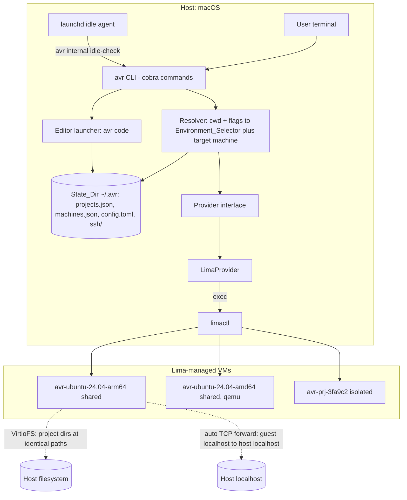

# Design Document — avar (`avr`)

## 1. Overview

avar is a single Go binary that presents a **directory-centric, shell-first** interface over Lima-managed Linux VMs. Every design decision follows from one product rule:

> The user thinks in terms of "current directory + selected operating environment." Machines, mounts, SSH, and images are avar's problem, never the user's.

### Key architectural decisions

| Decision | Choice | Rationale / trade-off |
|---|---|---|
| Virtualization backend | **Lima, driven via `limactl` subprocess** | Lima (Apache-2.0, CNCF incubating) already provides VM lifecycle, VirtioFS mounts, automatic localhost port forwarding, snapshots, and clone. Driving the CLI (vs importing Lima's Go packages) decouples avar from Lima's internal API churn and matches how Colima and other Lima frontends work. Cost: we parse `limactl` JSON output and depend on CLI stability, mitigated by a minimum-version check (Req 8.4). |
| Backend coupling | **`Provider` interface; `LimaProvider` is the only MVP implementation** | Command-layer code never references Lima. Post-MVP OrbStack/SSH/cloud providers slot in (Req 17.3). |
| Machine model | **One Shared_Machine per (distro, arch); per-project machines only under `--isolate`** | Shared-by-default gives WSL-like instant warm starts and package persistence (Req 4.3); isolation is opt-in and remembered per project (Req 11). |
| VM stack per arch | **Host-native arch → `vmType: vz` (+ Rosetta binfmt enabled); foreign arch (`--arch amd64` on Apple Silicon) → `vmType: qemu`** | vz gives VirtioFS and near-native speed. Rosetta inside the arm64 VM covers "run this x86 binary" cheaply; a full qemu x86_64 VM covers "the whole OS must be amd64," with a one-time performance warning (Req 4.6). |
| File sharing | **Live mount of registered project directories at identical paths; mounts registered in avar state and applied to machine config** | Identical paths make `pwd`, error traces, and editor links portable across the boundary (Req 6.1). Mount changes require a machine restart in Lima — see §3.5 for how this is made a rare, explained, one-time event (Req 6.4). |
| Shell transport | **`limactl shell --workdir <cwd>` for interactive + one-shot** | Lima already handles PTY allocation, SSH multiplexing, and arg escaping (`SetInterspersed(false)`, `--` support). avar adds cwd mapping, env policy, and exit-code propagation instead of reimplementing SSH. |
| State | **Flat JSON files in `~/.avr/` (State_Dir)** | Human-inspectable, trivially crash-recoverable (write-temp + rename), no daemon, no database. |
| No daemon | **avar is CLI-only; background behavior (idle stop) uses a `launchd` agent installed on demand** | Keeps the "one binary" promise (Req 17.2) while still delivering idle auto-stop (Req 5.5). |
| Language / CLI framework | **Go + `spf13/cobra`** | Single static binary, fast startup, first-class subprocess/PTY handling, same ecosystem as Lima itself. |

### Technology stack

- **Go 1.23+**, `spf13/cobra` (CLI), `golang.org/x/term` (TTY detection/raw mode), `creack/pty` only if needed for tests.
- **Lima ≥ 1.0** (minimum version pinned in code; checked at startup).
- **Distribution**: GoReleaser → GitHub Releases + Homebrew tap (`brew install <tap>/avr`), formula depends on `lima`.

## 2. Architecture



### Primary data flow — `avr` (interactive) and `avr <cmd>` (one-shot)

1. **Parse**: cobra parses avar flags up to the first non-flag token; everything after is the guest command (Req 2.5). `--` forces the boundary (Req 2.6).
2. **Resolve**: `Resolver` computes the Environment_Selector: distro/arch from flags → project's remembered isolation/config → global defaults. Project_Identity = SHA-256 of `filepath.EvalSymlinks(abs(cwd))`.
3. **Ensure deps**: Lima presence + minimum version (Req 8); offer `brew install lima` if absent.
4. **Ensure machine**: Provider creates (first use, with progress UI — Req 1.2) or starts (Req 1.3) the target machine.
5. **Ensure mount**: if the project root is not in the machine's applied mounts, register it, update machine config, restart machine with an explanatory message (Req 6.4, §3.5).
6. **Attach**: `limactl shell --workdir <cwd> <machine> [-- <cmd>...]` with env policy applied (Req 9.1, 12). Exit code is propagated (Req 1.7, 2.2).
7. **Record**: session start/end appended to `~/.avr/sessions.json` (drives idle stop and `avr status`).

## 3. Components and Interfaces

### 3.0 Package layout and dependency direction

Shared vocabulary lives in **`internal/types`**: `EnvironmentSelector`, `Arch`, `Distro`, the persisted records (`ProjectRecord`, `MachineRecord`, `SessionRecord`), `MachineStatus`, and the `ProgressSink` contract. It holds data definitions and their validation only — no I/O, no subprocess execution, no output — and it imports no other avar package.

This exists because `internal/state` must persist a selector while `internal/resolve` must read a project record: putting either type in the other's package creates a cycle. Dependencies therefore point inward:

```
cmd/  ─────────────────┐
  ├── internal/cli     │
  ├── internal/resolve ├──> internal/types
  ├── internal/state   │
  ├── internal/deps    │
  └── internal/provider┘   (provider/lima, provider/fake implement it)
```

`internal/provider` owns the `Provider` interface and its option structs (`MachineSpec`, `ShellOpts`) because they describe backend operations rather than shared vocabulary. Nothing in `cmd/` or `internal/resolve` may reference Lima (Req 17.3).

### 3.1 Command Layer (`cmd/`)

**Purpose**: Map the user-facing grammar onto internal services. Owns all output formatting; nothing below it prints to the terminal (except streamed guest I/O).

**Grammar** (cobra with `Flags().SetInterspersed(false)` on the root, mirroring `limactl shell`):

```
avr [selector flags] [--] [COMMAND [ARGS...]]     # no COMMAND → interactive shell
avr [selector flags] status | stop [--all] | code
avr snapshot [NAME] | restore NAME | reset [--yes]     (Phase 2)
avr isolate off                                        (Phase 2)

Selector flags: --arch arm64|amd64   --distro NAME[:VERSION]   --isolate | --shared
Forwarding flags (Phase 2): --env NAME[=V] (repeatable)  --env-file PATH  --ssh-agent
```

Subcommand-vs-guest-command resolution (Req 2.5/2.6): after selector flags, if the next token is a known avr subcommand it wins; `--` always forces guest execution. This is deterministic and documented in `avr --help`.

**Does not**: talk to `limactl`, read/write state files directly.

### 3.2 Resolver (`internal/resolve`)

**Purpose**: Turn (cwd, flags, state, optional `.avr.toml` post-MVP) into a fully-specified `EnvironmentSpec` + target machine name.

```go
type EnvironmentSelector struct {
    Distro   Distro   // ubuntu | debian | fedora (+ pinned version)
    Arch     Arch     // arm64 | amd64
    Isolated bool
}

type ResolvedTarget struct {
    Selector    EnvironmentSelector
    MachineName string      // deterministic, see naming below
    Project     ProjectRecord
    GuestCwd    string      // == host cwd (live mount, identical path)
}

func Resolve(cwd string, flags Flags, st *state.Store) (ResolvedTarget, error)
```

**Machine naming** (deterministic; the avar prefix is also the ownership marker for Req 5.4):

- Shared: `avr-<distro>-<version>-<arch>` → `avr-ubuntu-24.04-arm64`
- Isolated: `avr-prj-<first 10 hex of Project_Identity>`

**Precedence**: explicit flags > project record (remembered isolation, Req 11.2) > global `~/.avr/config.toml` defaults > built-in defaults (ubuntu 24.04, host arch, shared).

**Rationale**: a pure function over inputs makes selection trivially unit-testable and makes Property 2 (determinism) checkable.

### 3.3 State Store (`internal/state`)

**Purpose**: Durable, crash-consistent record of everything avar knows. All writes are atomic (write temp file, `fsync`, `rename`) and guarded by an advisory file lock (`~/.avr/lock`) so concurrent `avr` invocations serialize state mutations (Req 17.5).

Layout:

```
~/.avr/
  config.toml        # user-editable global defaults (idle timeout, resources, forward_env allowlist)
  projects.json      # Project_Identity → ProjectRecord
  machines.json      # machines avar created: name → MachineRecord
  sessions.json      # live session pids per machine (idle-stop input)
  ssh/config         # avar-owned SSH host entries (avr code), included via Include
  logs/              # provisioning logs (referenced in error messages)
```

**Does not**: know about Lima. Records what avar *intends*; `limactl list --json` is the source of truth for what *exists*, and reconciliation between the two is how crash recovery works (§6).

### 3.4 Provider Interface (`internal/provider`)

**Purpose**: Backend abstraction (Req 17.3). Command layer and Resolver depend only on this.

The operations are **segregated by capability** rather than gathered into one interface. `Provider` is the core set every backend must implement; `Snapshotter`, `SSHConfigProvider` and `PortDiagnoser` describe abilities a backend either has or does not. Callers that need a capability type-assert for it and report plainly when the backend lacks it. This keeps Phase 1's `LimaProvider` free of Phase 2 stubs and keeps a future SSH-only backend from having to fake snapshots it cannot take.

```go
type Provider interface {
    // EnsureMachine creates the machine if absent, starts it if stopped, and is a
    // silent no-op when it is already running (Req 1.2/1.3 — called every invocation).
    // On failure nothing half-created survives (Req 1.6, Property 7).
    // Emits Creating / Starting / Warning (emulation, Req 4.6) events.
    EnsureMachine(ctx context.Context, spec MachineSpec, progress types.ProgressSink) error

    // Shell attaches an interactive shell (empty Argv) or runs argv on an
    // already-running machine, and returns the guest exit code. A non-zero guest
    // status is (code, nil) — never a Go error (Req 1.7/2.2, Property 3).
    // Streams stdio; allocates PTY iff opts.TTY; forwards SIGINT/SIGTERM/SIGWINCH.
    // Takes no ProgressSink: once attached, avar is silent.
    Shell(ctx context.Context, machine string, opts ShellOpts) (exitCode int, err error)

    // Mounts. SetMounts takes the complete desired set and replaces what is applied,
    // which is what makes mount confinement checkable (Property 5). Idempotent: an
    // unchanged set means no restart (Req 17.1).
    AppliedMounts(ctx context.Context, machine string) ([]string, error)
    SetMounts(ctx context.Context, machine string, dirs []string, progress types.ProgressSink) error

    Stop(ctx context.Context, machine string, progress types.ProgressSink) error // stopped → no-op; unknown → ErrMachineNotFound
    Delete(ctx context.Context, machine string) error                            // fully idempotent (cleanup path, Property 7)
    Status(ctx context.Context) ([]types.MachineStatus, error)                   // avar-owned machines only, sorted (Req 5.4, Property 6)
}

// Phase 2 capabilities, implemented only by backends that actually have them.
type Snapshotter interface {
    Snapshot(ctx context.Context, machine, name string, progress types.ProgressSink) error
    RestoreSnapshot(ctx context.Context, machine, name string, progress types.ProgressSink) error
    ListSnapshots(ctx context.Context, machine string) ([]SnapshotInfo, error)
}

type SSHConfigProvider interface {
    SSHConfig(ctx context.Context, machine string) (string, error) // for avr code
}

// PortDiagnoser explains forwarding state (Req 7.2). Forwarding itself is not an
// operation — it happens without avar asking — so there is only something to report.
type PortDiagnoser interface {
    PortDiagnostics(ctx context.Context, machine string) ([]PortDiagnostic, error)
}

type MachineSpec struct {
    Name       string                     // avr-…, from the resolver (ownership marker)
    Selector   types.EnvironmentSelector
    Kind       types.MachineKind          // shared | isolated | base
    Mounts     []string                   // project roots to share at create time
    CPUs       int                        // zero → backend's host-proportional default (Req 17.4)
    MemoryGB   float64
    DiskGB     float64
    DeriveFrom string                     // optional pristine base to copy (Req 11.1); a hint, not a requirement
}

type ShellOpts struct {
    Workdir string
    Argv    []string          // empty → interactive login shell
    Env     map[string]string // ONLY what policy explicitly allows; never merged with the
                              // host environment (Req 9.1/12, Property 4)
    TTY     bool
    Stdin   io.Reader         // nil → the calling process's stream; redirection is invalid with TTY.
    Stdout  io.Writer         // Used by avar's own guest probes (e.g. mount verification, Req 6.5)
    Stderr  io.Writer         // so their output never reaches the user's terminal.
    ForwardSSHAgent bool      // Phase 2
}
```

Sentinel errors (`ErrNotOwned`, `ErrMachineNotFound`, `ErrMachineNotRunning`, `ErrSnapshotNotFound`) let the command layer react to a condition instead of matching message text; the error table in §6 maps them onto user-facing behavior.

### 3.5 LimaProvider (`internal/provider/lima`)

**Purpose**: Implement `Provider` by shelling out to `limactl`.

Key mappings:

| Provider op | limactl mechanism |
|---|---|
| Create machine | `limactl start --name <n> --tty=false <generated .yaml>` — avar generates a full Lima config from an embedded template per (distro, arch): base image URL (pinned, checksummed), `vmType` (vz native / qemu foreign), `rosetta: {enabled,binfmt}: true` on vz+arm64, CPU/mem/disk from Req 17.4, mounts list, `mountType: virtiofs` (vz), provision script (create user matching host username + NOPASSWD sudo — Lima does this by default). |
| Start | `limactl start <n> --tty=false` |
| Shell | `limactl shell --workdir <cwd> <n> [-- argv...]`; avar wraps with env policy (env vars passed as `FOO=bar` prefix tokens, which `limactl shell` quotes correctly) and inspects the child's exit code (`limactl shell` propagates the remote exit status). |
| Mounts | Read: `limactl list <n> --json` (`.config.mounts`). Write: `limactl edit <n> --set '.mounts = [...]' --tty=false`, then stop/start if running. |
| Port forwarding | Nothing to do — Lima's hostagent auto-forwards guest-localhost TCP ports to host localhost and releases them on close (Req 7.1/7.3). avar surfaces conflicts by reading the hostagent log in `avr status` diagnostics (Req 7.2). |
| Stop / Delete | `limactl stop <n>` / `limactl delete <n>` |
| Snapshot / Restore | `limactl snapshot create/apply/list <n> --tag <name>` (instance is stopped first if the operation requires it, then restarted if it was running). |
| Isolated create (fast path) | Keep a pristine, stopped base machine per (distro, arch) (`avr-base-<distro>-<ver>-<arch>`); `limactl clone` it for `--isolate` (clone copies disk + ssh config verbatim, so it is fast and deterministic). Fallback: full provision if no base exists. |
| Reset | `limactl delete <n>` + re-create from template/base (Req 10.3). |
| SSH config | `limactl show-ssh --format config <n>` → rewritten into `~/.avr/ssh/config` under host alias `avr-<machine>`. |

**Mount-change restart policy** (Req 6.4): mount edits requiring restart are expected to be rare (first `avr` in each new project). The provider reports a `ProgressSink` event ("Adding /Users/you/code/newproj to your Linux environment — one-time restart, ~10s") so the UX cost is explained. Registered mounts accumulate in the machine config, so revisiting any known project is instant.

**Ownership guard** (Req 5.4): every operation validates the machine name has the `avr-` prefix *and* appears in `machines.json`. `Status` filters `limactl list --json` by the same rule.

### 3.6 Dependency Manager (`internal/deps`)

**Purpose**: Req 8. `limactl --version` → parse → compare to `MinLimaVersion`. If missing: prompt (default No when non-interactive), run `brew install lima` streaming output, re-verify. If brew missing or declined: print manual instructions, exit 1.

### 3.7 Session & Idle Manager (`internal/session`) — Phase 2 for idle stop

**Purpose**: Track active sessions (Req 5.1 "in use", Req 5.5 idle stop).

- On attach, append `{machine, pid, started_at}` to `sessions.json`; remove on exit (defer + best-effort). Stale entries (dead pid) are pruned on every read.
- Idle stop: `avr` installs (with one-time notice) a `launchd` agent running `avr internal idle-check` every 10 min: for each running avar machine with zero live sessions and `last_activity + IdleTimeout < now`, call `Provider.Stop`. `idle_timeout = "0"` in config.toml disables it.

### 3.8 Editor Launcher (`internal/editor`) — Phase 2

**Purpose**: Req 13. Ensure machine running → write/refresh `~/.avr/ssh/config` entry → ensure user's `~/.ssh/config` has (or user approves adding) a single `Include ~/.avr/ssh/config` line (never touching other content, Req 13.3) → exec `code --remote ssh-remote+avr-<machine> <guest path>` → error with guidance if `code` absent (Req 13.2).

### 3.9 Env/Credential Forwarding Policy (`internal/envpolicy`) — Phase 2 (defaults enforced from Phase 1)

**Purpose**: Req 9.1/9.2, 12. Pure function: `(baseAllowlist=[TERM, LANG, LC_*], --env flags, --env-file, config.toml forward_env) → map[string]string`. `--ssh-agent` sets `ShellOpts.ForwardSSHAgent` for that invocation only (Req 12.3/12.4). Phase 1 ships the function with only the base allowlist wired.

## 4. Data Models

```go
type ProjectRecord struct {
    ID          string    `json:"id"`           // sha256(resolved abs path)
    Path        string    `json:"path"`         // resolved abs path (display + mount source)
    Isolated    bool      `json:"isolated"`     // remembered --isolate default (Req 11.2)
    Selector    *EnvironmentSelector `json:"selector,omitempty"` // remembered distro/arch overrides
    CreatedAt   time.Time `json:"created_at"`
    LastUsedAt  time.Time `json:"last_used_at"`
}

type MachineRecord struct {
    Name       string              `json:"name"`       // avr-… (ownership marker)
    Selector   EnvironmentSelector `json:"selector"`
    Kind       string              `json:"kind"`       // shared | isolated | base
    ProjectID  string              `json:"project_id,omitempty"` // for isolated
    Mounts     []string            `json:"mounts"`     // registered project roots
    CreatedAt  time.Time           `json:"created_at"`
    Lima       struct{ VMType string } `json:"lima"`   // vz | qemu (provider detail, stored for status display)
}

type SessionRecord struct {
    Machine   string    `json:"machine"`
    PID       int       `json:"pid"`
    StartedAt time.Time `json:"started_at"`
}
```

**Lifecycle rules**

- `ProjectRecord` is created the first time `avr` runs in a directory; never deleted automatically.
- `MachineRecord` is written **after** `limactl start` succeeds (create) and deleted **after** `limactl delete` succeeds — so `machines.json` never references a machine that was never viable (Req 1.6). Reconciliation (§6) handles the inverse (Lima machine exists, record missing → adopt if `avr-` prefixed; record exists, machine missing → drop record).
- Mount list on a machine only grows via project registration; `avr status` shows it; pruning is a post-MVP concern.

**Validation constraints**: machine names match `^avr-[a-z0-9.-]+$`; project paths must be absolute, exist, and be directories at registration time; distro/version pairs must be in the supported matrix (Req 4.4).

## 5. Correctness Properties

### Property 1: Working-directory equivalence
_For any_ host directory D whose project root is registered and mounted, running `avr` or `avr <cmd>` from D SHALL produce a guest process whose working directory path equals D and whose directory contents equal the host's.
**Validates: 1.1, 2.1, 6.1, 6.6**

### Property 2: Deterministic target resolution
_For any_ fixed (cwd, flags, state) input, `Resolve` SHALL return the same `ResolvedTarget`, and distinct (distro, arch) pairs SHALL never map to the same shared machine name.
**Validates: 4.1, 4.2, 4.3, 11.2**

### Property 3: Exit-code transparency
_For any_ guest command exiting with code N (0 ≤ N ≤ 255), `avr <cmd>` SHALL exit with code N; _for any_ interactive shell exiting with code N, `avr` SHALL exit with code N.
**Validates: 1.7, 2.2**

### Property 4: Environment isolation by default
_For any_ host environment variable V not in the base terminal allowlist and not explicitly forwarded, V SHALL be absent from the guest session's environment.
**Validates: 9.1, 12.4**

### Property 5: Mount confinement
_For any_ machine M, the set of host paths readable from M via avar-configured mounts SHALL be exactly the project roots registered to M — in particular, never `~` itself and never `~/.ssh`, `~/.aws`, or any unregistered sibling directory.
**Validates: 6.3, 9.3, 9.4, 11.5**

### Property 6: Ownership confinement
_For any_ Lima instance whose name lacks the `avr-` prefix or which is absent from `machines.json`, no avar operation SHALL list, start, stop, modify, or delete it.
**Validates: 5.4**

### Property 7: Provisioning atomicity
_For any_ failed or interrupted machine create, a subsequent `avr` invocation SHALL observe either (a) no record and no usable machine → clean re-provision, or (b) a consistent adopted state — never a wedged state requiring manual `limactl` intervention.
**Validates: 1.6, 17.5**

### Property 8: Signal and TTY fidelity
_For any_ one-shot command, a PTY SHALL be allocated iff host stdin is a TTY, and SIGINT/SIGTERM delivered to `avr` SHALL reach the guest process; _for any_ interactive session, terminal resize SHALL propagate.
**Validates: 2.3, 2.4, 3.1, 3.3**

### Property 9: Subcommand/guest-command resolution
_For any_ argv, the first non-selector-flag token SHALL be interpreted as an avar subcommand iff it is in the subcommand set, and prefixing `--` SHALL always force guest interpretation.
**Validates: 2.5, 2.6**

### Property 10: Reset scoping
_For any_ `avr reset`, host project files SHALL be byte-identical before and after, and _for any_ reset in a project with an Isolated_Environment, no other machine SHALL be modified.
**Validates: 10.3, 11.4**

### Property 11: Idle-stop safety
_For any_ machine with at least one live session, the idle agent SHALL NOT stop it, regardless of elapsed time.
**Validates: 5.5**

## 6. Error Handling

**Principles**: every failure names (what avar was doing) + (underlying cause, with the tail of the relevant log) + (one suggested next step). Guest command failures are *not* avar errors — stderr and exit code pass through untouched.

| Failure | Detection | Behavior |
|---|---|---|
| Lima missing / too old / brew missing | `deps` check at startup | Req 8.2–8.4 flows; exit 1; never proceed against unsupported Lima. |
| Provision fails (image download, qemu missing for amd64, disk full) | `limactl start` non-zero on create | Print cause + `~/.avr/logs/<machine>-create.log` path; `limactl delete` the partial instance; no `MachineRecord` written (Property 7). |
| Start fails on existing machine | `limactl start` non-zero | Report; suggest `avr status` and (Phase 2) `avr reset`. Do not auto-delete user data. |
| avar killed mid-create | Record absent but `limactl list` shows `avr-` instance in `Broken`/stopped-new state | Reconciler on next run: instance healthy → adopt into `machines.json`; broken → delete and re-provision after informing the user. |
| Mount not possible (network volume, perms) | pre-flight `os.Stat` + mount verification after apply (`test -d` in guest) | Exit 1 with explanation; never drop into a shell at a wrong/empty path (Req 6.5). |
| Mount requires restart while other sessions are live on that machine | `sessions.json` check | Prompt: restart now (disconnects N sessions) or abort. Non-interactive: abort with message. |
| Host port conflict | hostagent log scan | Session unaffected; `avr status` lists unforwardable ports (Req 7.2). |
| Concurrent `avr` invocations racing on create | file lock around ensure-machine | Second invocation waits on lock, then re-checks state (create becomes start/no-op). |
| `sessions.json` stale pids (crash) | pid liveness probe on read | Prune silently. |
| Snapshot/restore name errors | `limactl snapshot list` | Unknown name → list available (Req 10.2). |
| `code` CLI missing | `exec.LookPath` | Req 13.2 guidance. |
| `--env-file` missing/unparseable | pre-flight | Exit 1 before any machine work (Req 12.2). |
| Ctrl-C during provisioning | context cancellation | Stop `limactl`, clean up partial instance, exit 130. |

## 7. Testing Strategy

**Unit tests** (pure logic, no VMs):
- `Resolve` precedence table + machine-name determinism (Property 2).
- Argv grammar: subcommand vs guest command vs `--` (Property 9) — table-driven over tricky argvs (`avr status`, `avr -- status`, `avr --arch amd64 npm test`, `avr --distro fedora code`).
- Env policy allowlist composition (Property 4).
- State store: atomic write + lock behavior; reconciler decision table (Property 7 cases).
- limactl output parsing against recorded `limactl list --json` fixtures from the pinned minimum Lima version.

**Integration tests — FakeProvider** (in-process `Provider` recording calls): full command flows (`avr` first-run, mount-add restart flow, `stop --all`, isolation remembering, reset scoping — Properties 5, 6, 10, 11) asserted on provider call sequences without VMs.

**End-to-end tests — real Lima** (separate `make e2e`, runs on a mac runner, not in unit CI):
- Cold `avr true` → provisions, exits 0; warm `avr sh -c 'exit 42'` → exits 42 (Property 3).
- `avr pwd` from nested subdir equals host path; touch file both sides (Property 1).
- `env` in guest shows no leaked host secret var (Property 4).
- Server in guest on :3000 reachable from host (Req 7.1).
- Warm-path attach overhead measured < 500 ms budget (Req 17.1).

**Property-based tests**: fuzz argv splitting (Property 9) and env-policy composition (Property 4) with `testing/quick` or `rapid`.

## 8. Out of Scope (recorded for post-MVP alignment)

`--native-fs` sync mode (Lima's `limactl shell --sync` is the intended substrate — Req 14), `.avr.toml` + `avr init` detection (Req 15), `avr ports`/`avr open` (Req 16), additional editors (cursor/zed), OrbStack/SSH/cloud providers, VS Code terminal-picker extension, Linux hosts, GUI.
